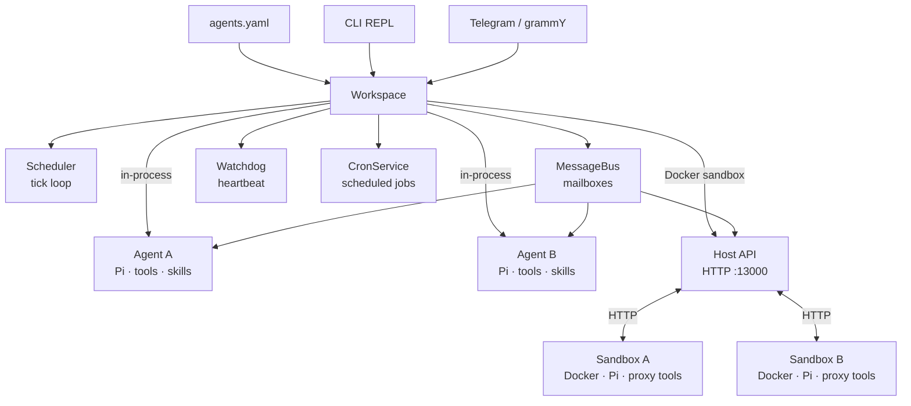

# pi-tests

FreeRTOS-inspired multi-agent workspace manager built on [Pi](https://github.com/nichochar/pi-mono). Spawns and orchestrates AI agent instances with tick-based scheduling, priority queues, mailbox IPC, cross-agent file access, watchdog monitoring, proactive cron jobs, optional Docker sandbox isolation, declarative YAML configuration, and Telegram as a messaging frontend.

## Architecture



**Core flow:** `agents.yaml` (auto-spawn) / CLI / Telegram / Cron -> Workspace -> Scheduler tick -> drain mailbox -> dispatch to Pi Agent -> agent runs tools -> response streamed to Telegram.

Each agent is a full Pi coding agent with its own filesystem workspace, skills, and injected collaboration tools (`send_mail`, `list_agents`, `read_agent_file`, `authenticated_fetch`). The scheduler runs a FreeRTOS-style tick loop that serves agents by priority, one message per tick per agent, non-blocking.

Agents can run **in-process** (default) or inside **Docker containers** for full process-level isolation.

## Quick Start

```bash
pnpm install

# Configure .env
cp .env.example .env   # then fill in your keys

# Start the REPL (in-process agents, Telegram auto-connects if token set)
pnpm dev start

# Start with Docker sandbox isolation
pnpm dev start --sandbox docker
```

Create a `.env` file with your provider keys:

```env
OPENAI_API_KEY=sk-...
# ANTHROPIC_API_KEY=sk-...
# GEMINI_API_KEY=...
TELEGRAM_BOT_TOKEN=...          # Telegram bridge auto-enables when set
# TELEGRAM_ENABLED=false        # Set to disable Telegram
# ALLOWED_USERS=alice,bob       # Comma-separated allowlist (empty = open access)
# MY_GH_TOKEN=ghp_...           # Host env vars for secret refs (agents.yaml secrets)
```

## Declarative Configuration (`agents.yaml`)

Define your workspace once in `~/.pi-tests/agents.yaml` and agents auto-spawn on startup. No more manual REPL commands on every restart.

```yaml
# ~/.pi-tests/agents.yaml
agents:
  designer:
    model: anthropic:claude-sonnet-4-20250514
    priority: normal        # idle | low | normal | high | critical (or 0-4)
    thinking: low           # off | minimal | low | medium | high | xhigh
    description: "Frontend designer — builds HTML/CSS"
    prompt: |
      You are a frontend designer specializing in responsive layouts.
      Focus on clean, semantic HTML and modern CSS.
    skills:
      - nichochar/web-skills
    api_key_ref: MY_CUSTOM_KEY     # optional — host env var name for model key override
    env:                           # non-sensitive, passed as Docker --env
      LOG_LEVEL: debug
      WORKSPACE_NAME: designer
    secrets:                       # sensitive, ${VAR} refs only — delivered via authenticated_fetch
      GITHUB_TOKEN: ${MY_GH_TOKEN}
    disclose_secrets: true         # show secret names in system prompt (default: false)

  reviewer:
    model: openai:gpt-4.1
    priority: high
    thinking: medium
    description: "Code reviewer"
```

All fields are optional. Agents are spawned sequentially in declaration order; if one fails, the rest still start.

| Field | Type | Default | Description |
|---|---|---|---|
| `model` | string | `anthropic:claude-sonnet-4-20250514` | `provider:model-id` |
| `priority` | string \| number | `normal` | Priority name or 0-4 |
| `thinking` | string | `low` | `off` / `minimal` / `low` / `medium` / `high` / `xhigh` |
| `description` | string | `""` | Visible to other agents |
| `prompt` | string | _(built-in default)_ | Custom system prompt |
| `cwd` | string | `~/.pi-tests/agents/<name>/workspace` | Working directory |
| `skills` | string[] | `[]` | GitHub sources to auto-install (`owner/repo`) |
| `api_key_ref` | string | _(auto from provider)_ | Host env var name for model API key |
| `env` | map | `{}` | Non-sensitive env vars (Docker `--env`, supports `${VAR}` refs) |
| `secrets` | map | `{}` | Secret refs in `${VAR}` format (delivered via `authenticated_fetch`) |
| `disclose_secrets` | boolean | `false` | Show secret names in system prompt |
| `cron` | map | `{}` | Named cron jobs (see [Cron Jobs](#cron-jobs)) |

### Auto-Sync

REPL commands automatically keep `agents.yaml` in sync:

- **`spawn`** persists the agent to YAML (use `--ephemeral` to skip)
- **`kill`** removes the agent from YAML
- **`skill add/remove`** updates the agent's `skills` array in YAML

All writes are atomic (temp file + rename) and serialized through an in-process config lock to prevent concurrent corruption.

### Reload

```bash
# In the REPL:
pi> agents reload              # Spawn new agents from YAML, skip already-running
pi> agents reload --force      # Kill and re-spawn agents with changed config
pi> agents validate            # Dry-run: parse + validate without spawning
pi> agents path                # Print path to agents.yaml
```

### Cron Jobs

Agents can run proactively on schedules via per-agent cron jobs. The host-side `CronService` manages timers and injects messages into the bus with `from: "__cron__"` — agents never see cron internals.

```yaml
# ~/.pi-tests/agents.yaml
agents:
  standup-bot:
    model: anthropic:claude-sonnet-4-20250514
    cron:
      daily-standup:
        schedule: "0 9 * * 1-5"        # 5-field only (min hour dom month dow)
        message: "Run the daily standup"
        timezone: "America/New_York"    # optional, default UTC
        catch_up: once                  # optional: "skip" (default) | "once"
        enabled: true                   # optional, default true
```

| Field | Required | Default | Description |
|---|---|---|---|
| `schedule` | yes | — | 5-field cron expression (`@daily`/`@hourly` rejected) |
| `message` | yes | — | Prompt text sent to the agent |
| `timezone` | no | `UTC` | IANA timezone for schedule evaluation |
| `catch_up` | no | `skip` | `skip` = ignore missed fires on restart; `once` = fire one catch-up message |
| `enabled` | no | `true` | Set `false` to pause without removing |

Job names must match `[a-zA-Z0-9_-]+`. Each agent can have 0-N named jobs.

**Catch-up behavior:** On restart, if `catch_up: once` and a fire was missed since the last run, one immediate message is sent. First-ever run (no prior state) never catches up. State persists to `~/.pi-tests/cron/state.json`.

**Safety guards:** Busy agents (status `running`) are skipped. A global dispatch cap of 60 cron messages per minute prevents misconfigured schedules from flooding the bus.

#### Cron CLI Commands

```bash
# In the REPL:
pi> cron list                                          # List all cron jobs
pi> cron status [agent]                                # Detailed job status
pi> cron add <agent> <job> "<schedule>" <message> [--apply]   # Add a job
pi> cron remove <agent> <job> [--apply]                # Remove a job
pi> cron trigger <agent> <job>                         # Fire immediately
pi> cron enable <agent> <job> [--apply]                # Re-enable a paused job
pi> cron disable <agent> <job> [--apply]               # Pause a job
```

Without `--apply`, commands write to `agents.yaml` only — run `agents reload` to activate. With `--apply`, changes take effect immediately if the agent is running.

Change detection uses normalized config comparison (resolved model, numeric priority, sorted skills, trimmed prompt) so cosmetic YAML differences like `normal` vs `2` or reordered skills don't trigger false warnings.

## Sandbox Modes

pi-tests supports two execution modes for agents:

### In-Process Mode (default)

```bash
pnpm dev start                  # or explicitly:
pnpm dev start --sandbox none
```

Agents run in the same Node.js process as the scheduler. Simple, fast, zero setup. Tools call directly into the message bus and filesystem.

**Best for:** development, single-user setups, trusted agent code.

### Docker Sandbox Mode

```bash
pnpm dev start --sandbox docker
```

Each agent runs inside an isolated Docker container with hardened security. Agents communicate with the host via HTTP through the Host API.

**Best for:** untrusted agent code, multi-tenant environments, production deployments.

**Requirements:** Docker must be installed and running.

**Build tooling:** The sandbox image includes `python3`, `make`, and `g++` so agents can `npm install` packages with native addons (node-gyp).

#### How Docker Sandbox Works

```
Host Process                        Docker Container (per agent)
+---------------------------+       +-----------------------------+
| Workspace                 |       | sandbox-entry.ts            |
| Scheduler + MessageBus    |       | Pi Agent + coding tools     |
| Host API server (:13000)  |<-HTTP>| Proxy tools (HTTP->Host)    |
| DockerProvider            |       | HTTP server (:3100)         |
| Watchdog                  |       | Heartbeat loop (5s)         |
+---------------------------+       +-----------------------------+
```

1. **Workspace** generates a unique auth token per agent and registers it with the Host API.
2. **DockerProvider** builds the `pi-sandbox` Docker image (once), then runs a container per agent with:
   - `--cap-drop=ALL` — no Linux capabilities
   - `--security-opt no-new-privileges` — no privilege escalation
   - `--user 1000:1000` — non-root user
   - Volume mount: host workspace directory -> `/workspace` in container
3. **sandbox-entry.ts** (inside container) creates a Pi Agent with:
   - Local coding tools (read, write, edit, bash, grep, find, ls) scoped to `/workspace`
   - Proxy tools that forward `send_mail`, `list_agents`, `read_agent_file` to the Host API over HTTP
4. **Host API** authenticates requests via Bearer token, executes them against the message bus / filesystem, and returns results.
5. **Prompt flow:** Host sends `POST /prompt` to container -> agent processes -> container sends `POST /api/prompt-done` back to host.
6. **Heartbeat:** Container sends `POST /api/heartbeat` every 5 seconds. Watchdog monitors these for stuck detection.

#### Docker Sandbox Security Model

| Protection | Mechanism |
|---|---|
| Process isolation | Separate Docker container per agent |
| No root access | `--user 1000:1000`, `--cap-drop=ALL`, `no-new-privileges` |
| Filesystem isolation | Only the agent's own workspace is mounted |
| Secret isolation | Model API key via `GET /api/secrets` (memory-only, never in Docker env) |
| Tool secret isolation | Per-agent secrets resolved host-side via `authenticated_fetch` — never enter container |
| Output redaction | Two-layer: sandbox-side + host-side redaction of secrets in events and fetch responses |
| SSRF protection | Two-layer: literal IP check + DNS resolution (blocks private, loopback, link-local, IPv4-mapped IPv6) |
| Cross-agent file access | Proxied through Host API with path traversal guards |
| Authentication | Unique per-agent Bearer token on all endpoints (except `/health`) |
| Message integrity | Server derives sender identity from token, never trusts body |
| Idempotency | `messageId`-based deduplication with 5-minute TTL |
| Request limits | 64 KB send-mail body, 1 MB general body, 1 MB file response |
| Prompt timeout | 5-minute timeout on prompt completion |

#### Docker Sandbox Example

```bash
# Terminal 1: Start with Docker sandbox
pnpm dev start --sandbox docker

# In the REPL:
pi> spawn designer --model anthropic:claude-sonnet-4-20250514 --desc "Frontend designer"
# → [agent:designer] Started in sandbox (http://localhost:13100)

pi> spawn reviewer --model openai:gpt-4.1 --desc "Code reviewer"
# → [agent:reviewer] Started in sandbox (http://localhost:13101)

pi> send designer "Create a responsive landing page with hero section"
# → designer works inside its Docker container, edits files in /workspace
# → Files persist at ~/.pi-tests/agents/designer/workspace/ on the host

pi> send reviewer "Review designer's index.html and send feedback"
# → reviewer uses read_agent_file (proxied via Host API) to read designer's files
# → reviewer uses send_mail (proxied via Host API) to send feedback to designer
```

Verify files created by sandboxed agents persist on the host:

```bash
ls ~/.pi-tests/agents/designer/workspace/
# index.html  styles.css  ...
```

#### Host API Endpoints

The Host API runs on port 13000 (configurable) and provides the bridge between sandboxed agents and the host system.

| Method | Path | Purpose |
|---|---|---|
| `GET` | `/api/secrets` | Fetch secrets (model API key + tool secrets) at container boot |
| `POST` | `/api/send-mail` | Forward message to another agent's mailbox |
| `GET` | `/api/agents` | List all agents (name, status, description) |
| `GET` | `/api/agent-file?agent=X&path=Y` | Read file from another agent's workspace |
| `POST` | `/api/authenticated-fetch` | Host-proxied HTTP request with secret injection |
| `POST` | `/api/prompt-done` | Notify host that a prompt completed |
| `POST` | `/api/agent-event` | Forward agent events to host (redacted) |
| `POST` | `/api/heartbeat` | Update agent heartbeat timestamp |

All endpoints require `Authorization: Bearer <token>` header. The token is generated per agent by the host and injected into the container as an environment variable. Model API keys are never passed as Docker env vars — they are fetched via `GET /api/secrets` at boot and stored in memory only.

## REPL Commands

| Command | Description |
|---|---|
| `spawn <name> [options]` | Create a new agent (persists to YAML unless `--ephemeral`) |
| `list` | Show all agents with status table |
| `send <agent> <message>` | Queue a message for an agent |
| `kill <agent>` | Stop and remove an agent (removes from YAML) |
| `status` | Show scheduler, watchdog, and resource state |
| `skill add <agent> <source>` | Install skills from GitHub (`owner/repo`) |
| `skill list <agent>` | List installed skills |
| `skill remove <agent> <name>` | Remove an installed skill |
| `agent env set <agent> <KEY> <VALUE>` | Set env var in `agents.yaml` |
| `agent env unset <agent> <KEY>` | Remove env var from `agents.yaml` |
| `agent secret-ref set <agent> <KEY> <ENV>` | Set secret ref in `agents.yaml` |
| `agent secret-ref unset <agent> <KEY>` | Remove secret ref from `agents.yaml` |
| `agent config show <agent>` | Show agent config (secrets redacted) |
| `agents reload [--force]` | Re-apply `agents.yaml` (force kills changed agents) |
| `agents validate` | Dry-run: parse + validate YAML without spawning |
| `agents path` | Print path to `agents.yaml` |
| `cron list` | List all cron jobs |
| `cron status [agent]` | Detailed cron job status |
| `cron add <agent> <job> "<sched>" <msg> [--apply]` | Add a cron job |
| `cron remove <agent> <job> [--apply]` | Remove a cron job |
| `cron trigger <agent> <job>` | Fire a cron job immediately |
| `cron enable <agent> <job> [--apply]` | Re-enable a paused job |
| `cron disable <agent> <job> [--apply]` | Pause a cron job |
| `route <chatId> <agent>` | Route a Telegram chat to an agent |
| `route list` | List all Telegram chat routes |
| `help` | Show available commands |
| `exit` | Shutdown |

### Spawn Options

```
spawn <name>
  --model <provider:id>     Model (default: anthropic:claude-sonnet-4-20250514)
  --priority <0-4>          0=IDLE, 1=LOW, 2=NORMAL, 3=HIGH, 4=CRITICAL
  --thinking <level>        off, minimal, low, medium, high, xhigh
  --cwd <path>              Custom workspace dir (default: ~/.pi-tests/agents/<name>/workspace)
  --desc <text>             Agent description (visible to other agents)
  --prompt <text>           Custom system prompt
  --api-key-ref <ENV_NAME>  Host env var for model API key override
  --env <KEY=VALUE>         Non-sensitive env var (repeatable)
  --secret-ref <KEY=ENV>    Secret ref mapping (repeatable)
  --ephemeral               Don't persist to agents.yaml
```

### CLI Flags

```
pnpm dev start
  --tick-interval <ms>      Scheduler tick interval (default: 2000)
  --sandbox <mode>          Sandbox mode: none | docker (default: none)
```

Telegram is enabled automatically when `TELEGRAM_BOT_TOKEN` is set. Disable via `TELEGRAM_ENABLED=false` in `.env`.

## Agent Collaboration

Agents discover and communicate with each other autonomously through three built-in tools. Tool schemas are defined once in `src/agent/tools/contracts.ts` and shared by both in-process and proxy (sandbox) implementations.

### `list_agents`

Discover all agents in the workspace with their name, status, and description. Agents are instructed to call this first when given a task to find collaborators.

### `send_mail`

Send a message to another agent's mailbox. Messages are delivered on the next scheduler tick as a new prompt prefixed with `[Mail from sender]`. Use `__broadcast__` to message all agents.

```
copywriter calls send_mail:
  to: "designer"
  message: "Here's the landing page copy: ..."

-> Message lands in designer's mailbox
-> Next tick delivers it as: [Mail from copywriter]\nHere's the landing page copy: ...
-> Designer starts working
```

### `read_agent_file`

Read files directly from another agent's workspace without needing to ask them. Path traversal is blocked for security.

```
reviewer calls read_agent_file:
  agent: "designer"
  path: "index.html"

-> Returns contents of ~/.pi-tests/agents/designer/workspace/index.html
```

In Docker sandbox mode, this tool is proxied through the Host API. The agent sends an HTTP request to the host, which reads the file on disk and returns the content. The sandboxed agent never has direct filesystem access to other agents' workspaces.

### `authenticated_fetch`

Make HTTP requests to external APIs using pre-configured secrets. The secret is injected server-side and never exposed to the agent process — the agent only knows the secret _name_, not its value.

```
agent calls authenticated_fetch:
  url: "https://api.github.com/user/repos"
  secretName: "GITHUB_TOKEN"
  method: "GET"

-> Host resolves GITHUB_TOKEN to the actual value from process.env
-> Host injects Authorization: Bearer ghp_... header
-> Host makes the outbound HTTPS request
-> Host redacts secret value from response body
-> Agent receives: HTTP 200 OK\n\n[{"id":1,"name":"my-repo",...}]
```

#### How It Works

1. **Configuration** — secrets are declared in `agents.yaml` using `${VAR}` refs:

   ```yaml
   agents:
     my-agent:
       model: anthropic:claude-sonnet-4-20250514
       secrets:
         GITHUB_TOKEN: ${MY_GH_TOKEN}
         SLACK_TOKEN: ${MY_SLACK_TOKEN}
       disclose_secrets: true    # agent sees names, never values
   ```

2. **Resolution** — at spawn time, `${MY_GH_TOKEN}` is resolved from `process.env`. Missing refs fail fast with a clear error. The resolved values are stored in memory on the host, never written to disk or Docker env vars.

3. **Tool injection** — the `authenticated_fetch` tool is automatically added to agents that have at least one secret configured. No secrets = no tool.

4. **Execution** — when the agent calls the tool:
   - **In-process:** the host tool resolves the secret, validates the request (SSRF, HTTPS, headers), makes the fetch, and redacts the secret from the response.
   - **Docker sandbox:** the proxy tool forwards the request to `POST /api/authenticated-fetch` on the Host API. The host resolves the secret, makes the outbound request, redacts the response, and returns it. The secret never enters the container.

5. **Response redaction** — before the response reaches the agent, the secret value is scrubbed from both the response body and headers. This prevents reflection attacks where an upstream endpoint echoes back the `Authorization` header.

#### Security Guardrails

| Protection | Detail |
|---|---|
| HTTPS required | Only `https://` URLs allowed (localhost exempt in dev) |
| SSRF (literal) | Blocks private IPs: `10.x`, `172.16-31.x`, `192.168.x`, `127.x`, `169.254.x`, `0.0.0.0` |
| SSRF (DNS) | Resolves hostnames via `dns.resolve4`/`resolve6`, checks all IPs — catches `evil.com → 127.0.0.1` |
| SSRF (IPv6) | Blocks `::1`, `fc00::/7`, `fe80::/10`, IPv4-mapped forms (`::ffff:7f00:1`, `::ffff:127.0.0.1`) |
| Auth header injection | Auth header set _after_ user headers — cannot be overridden by the agent |
| Blocked headers | `Host`, `Content-Length`, `Transfer-Encoding`, `Connection`, `Cookie` are silently stripped |
| Header name allowlist | Only `Authorization`, `X-API-Key`, `Api-Key` allowed as auth header names |
| Reserved secrets | `MODEL_API_KEY` cannot be used with `authenticated_fetch` (prevents exfiltration) |
| Size limits | Request body: 1 MB, Response body: 5 MB |
| Timeout | 30-second timeout on outbound requests |
| Response redaction | Secret value scrubbed from response body and headers before agent sees it |
| Agent isolation | Each agent can only access its own secrets — agent A cannot use agent B's tokens |

#### `secrets` vs `env` — When to Use Which

Secrets are only usable through two host-side paths:

- **Model auth** — `MODEL_API_KEY` is consumed by the agent runtime's `getApiKey()` callback to authenticate with model providers (Anthropic, OpenAI, etc.)
- **HTTP calls** — tool secrets (`GITHUB_TOKEN`, etc.) are consumed via `authenticated_fetch`, where the host injects the secret into outbound requests

In both cases, the raw secret value is **never exposed** to agent code — it's not in `process.env`, not on disk, and not in Docker env vars. The agent only knows the secret _name_.

This means if a project inside the agent workspace needs a raw key (e.g. an SDK that reads `process.env.X_API_KEY`), secrets won't work for that. Use `env` instead:

| | `secrets` | `env` |
|---|---|---|
| Agent can read value | No | Yes (visible in `process.env` / bash) |
| Usable by SDKs/CLIs | No — only via `authenticated_fetch` | Yes — available as env var |
| Appears in Docker env | No | Yes (`--env`) |
| Redacted from logs | Yes (response + event redaction) | No |
| Requires `${VAR}` format | Yes | Yes (supports `${VAR}` and literals) |

**Rule of thumb:** use `secrets` when the agent only needs to make authenticated HTTP calls (API tokens, webhooks). Use `env` when workspace code needs the raw value (SDK clients, CLI tools, build scripts) — but accept that the agent can read it.

#### Auth Modes

The `auth` parameter controls how the secret is injected into the request:

| Mode | Header value | Example |
|---|---|---|
| `bearer` (default) | `Bearer <secret>` | `Authorization: Bearer ghp_abc123` |
| `token` | `token <secret>` | `Authorization: token ghp_abc123` |
| `raw` | `<secret>` | `X-API-Key: ghp_abc123` |

```
# Custom auth mode example:
agent calls authenticated_fetch:
  url: "https://api.service.com/data"
  secretName: "SERVICE_KEY"
  auth: { mode: "raw", headerName: "X-API-Key" }

-> Header injected: X-API-Key: <resolved secret value>
```

### Tool Architecture

```
src/agent/tools/
  contracts.ts              Single source of truth (name, label, description, parameters)
  fetch-helpers.ts          Shared SSRF protection, URL validation, auth header builder
  send-mail.ts              Host implementation (direct bus.send)
  list-agents.ts            Host implementation (direct listFn call)
  read-agent-file.ts        Host implementation (direct fs access)
  authenticated-fetch.ts    Host implementation (outbound fetch with secret injection)
  proxy/
    send-mail.ts            Sandbox implementation (HTTP POST /api/send-mail)
    list-agents.ts          Sandbox implementation (HTTP GET /api/agents)
    read-agent-file.ts      Sandbox implementation (HTTP GET /api/agent-file)
    authenticated-fetch.ts  Sandbox implementation (HTTP POST /api/authenticated-fetch)
    index.ts                Barrel export + HostFetch type
```

In-process agents use the host implementations directly. Sandboxed agents use the proxy implementations, which forward requests to the Host API over HTTP. Both share the same tool contracts and validation helpers to prevent drift.

### Collaboration Prompt

Agents are prompted to:

- Always use `list_agents` first to discover collaborators
- Use `send_mail` for delegation, `read_agent_file` for code review, and `authenticated_fetch` for external APIs
- Never ask the user for information another agent can provide
- Avoid reply loops — only send actionable messages, not pleasantries
- Report completion back to the user when all delegated work is done

## Telegram Integration

Telegram bridge auto-enables when `TELEGRAM_BOT_TOKEN` is set in `.env` or the environment. All agent events (tool calls, text responses, completion) stream to the originating chat.

```env
# .env
TELEGRAM_BOT_TOKEN=xxx
# TELEGRAM_ENABLED=false   # uncomment to disable
# ALLOWED_USERS=alice,bob  # optional allowlist
```

```bash
pnpm dev start   # Telegram connects automatically
```

### Telegram Commands

| Command | Description |
|---|---|
| `/agents` | List all running agents |
| `/help` | Show available commands |
| `@agentname message` | Send directly to a specific agent |
| _(plain text)_ | Send to the default agent or routed agent |

Each agent's events route to the chat that triggered it, so multiple chats can interact with different agents concurrently.

## Concepts

### Tick-Based Scheduler

The scheduler runs a `setInterval` tick loop (default 2s). Each tick:

1. Sorts agents by priority (CRITICAL=4 first, IDLE=0 last)
2. Skips agents currently running (`status === "running"`)
3. Drains each agent's mailbox, delivers the highest-priority message
4. Dispatches non-blocking — all agents run concurrently via async I/O
5. Re-queues remaining messages for the next tick

```
--tick-interval <ms>    Configure via CLI flag (default: 2000)
```

### Priority Levels

| Level | Value | Use case |
|---|---|---|
| `IDLE` | 0 | Background tasks, monitoring |
| `LOW` | 1 | Review, optimization |
| `NORMAL` | 2 | Standard work (default) |
| `HIGH` | 3 | Primary agents, user-facing |
| `CRITICAL` | 4 | Urgent, time-sensitive |

Higher-priority agents are always served first. One message per tick per agent prevents starvation.

### Workspace Sandboxing

Each agent gets an isolated workspace on the host filesystem:

```
~/.pi-tests/
  agents.yaml               # declarative agent definitions
  cron/
    state.json              # cron job state (last run times, run counts)
  agents/
    designer/
      workspace/            # agent's cwd — all file tools scoped here
      skills/               # installed skill directories
        .sources.json       # skill folder → GitHub source mapping
    reviewer/
      workspace/
      skills/
```

All file tools (read, write, edit, bash) are scoped to the agent's workspace directory. Agents can read each other's files via `read_agent_file` but cannot write to them.

In Docker sandbox mode, the workspace directory is volume-mounted into the container at `/workspace`. File changes made inside the container persist on the host.

### Skills

Markdown files loaded from each agent's `skills/` directory and injected into the system prompt. Skills work in both in-process and Docker sandbox modes.

Skills can be installed via REPL or declared in `agents.yaml`:

```yaml
# agents.yaml — skills auto-install on startup
agents:
  designer:
    skills:
      - nichochar/web-skills
```

```bash
# REPL — installs to disk + updates agents.yaml
pi> skill add designer nichochar/web-skills
pi> skill list designer
pi> skill remove designer web-tools
```

A `.sources.json` file in each agent's skills directory maps installed skill folders back to their GitHub source, so `skill remove` can clean up `agents.yaml` entries when the last skill from a source is removed.

### Watchdog

Periodic heartbeat checks (default: every 10s). If an agent's last heartbeat exceeds the stuck threshold (default: 120s), it aborts and re-initializes with a fresh Pi instance. Every agent event resets the heartbeat timer.

For Docker-sandboxed agents, heartbeats are received via `POST /api/heartbeat` from the container (every 5s) and fed into the watchdog through the same monitoring path.

### Resource Guards

Mutex and semaphore primitives for coordinating shared resource access:

```ts
// Mutex — one holder at a time
const release = await workspace.mutex.acquire("database", "agent-a");
release();

// Semaphore — N concurrent holders
workspace.semaphore.create("api-rate-limit", 3);
const release = await workspace.semaphore.acquire("api-rate-limit");
release();
```

## End-to-End Examples

### Example 1: In-Process Multi-Agent Collaboration

Three agents collaborate on a landing page, all running in-process:

```
pi> spawn designer --model openai:gpt-5.2-codex --desc "Frontend designer — builds HTML/CSS"
pi> spawn copywriter --model openai:gpt-5.2-codex --desc "Copywriter — writes marketing copy"
pi> spawn reviewer --model openai:gpt-5.2-codex --desc "Code reviewer — reviews quality"
```

Via Telegram:

```
@copywriter Write landing page copy for FlowPilot, an AI task manager.
Include hero, 3 features, CTA. Send to designer when done.
```

What happens:

1. **copywriter** writes copy, uses `list_agents` to discover designer, sends via `send_mail`
2. **designer** receives mail, builds `index.html` with the copy
3. You send: `@reviewer Review designer's work and send feedback`
4. **reviewer** calls `list_agents`, uses `read_agent_file` to read designer's HTML, sends feedback via `send_mail`
5. **designer** applies fixes, **copywriter** reports completion to the user

All coordination is autonomous after the initial prompt.

### Example 2: Docker-Sandboxed Agent Workflow

Isolated agents working on a Node.js API project:

```bash
# Start with Docker isolation
pnpm dev start --sandbox docker
```

```
pi> spawn backend --model anthropic:claude-sonnet-4-20250514 --desc "Backend developer — writes Node.js APIs"
# → Container started with --cap-drop=ALL, --user 1000:1000

pi> spawn tester --model anthropic:claude-sonnet-4-20250514 --desc "QA engineer — writes and runs tests"

pi> send backend "Build a REST API for a todo app with CRUD endpoints using Express"
```

What happens behind the scenes:

1. **DockerProvider** builds the `pi-sandbox` image (once, cached)
2. Two containers start on ports 13100 and 13101
3. **backend** agent runs inside its container:
   - Uses `bash`, `write_file`, `edit_file` tools locally in `/workspace`
   - Creates `server.js`, `package.json`, route files
   - Files appear at `~/.pi-tests/agents/backend/workspace/` on host
4. You send: `@tester Review backend's code and write tests`
5. **tester** calls `list_agents` (proxy -> Host API -> returns agent list)
6. **tester** calls `read_agent_file` (proxy -> Host API -> reads backend's files from host disk)
7. **tester** writes test files in its own `/workspace`
8. **tester** sends feedback to **backend** via `send_mail` (proxy -> Host API -> message bus)

Each agent is fully isolated — a misbehaving agent cannot crash the host, read secrets, or access another agent's filesystem directly.

### Example 3: Authenticated Fetch with External APIs

An agent uses pre-configured secrets to interact with the GitHub API — the secret never touches the agent process:

```bash
# Set the host env var with your GitHub PAT
export MY_GH_TOKEN="ghp_..."
```

**Option A: Via REPL**

```
pi> spawn github-bot --model anthropic:claude-sonnet-4-20250514 \
    --desc "GitHub integration bot" \
    --secret-ref GITHUB_TOKEN=MY_GH_TOKEN

pi> send github-bot "List my GitHub repos using authenticated_fetch with secretName GITHUB_TOKEN"
```

**Option B: Via agents.yaml**

```yaml
# ~/.pi-tests/agents.yaml
agents:
  github-bot:
    model: anthropic:claude-sonnet-4-20250514
    description: "GitHub integration bot"
    secrets:
      GITHUB_TOKEN: ${MY_GH_TOKEN}
    disclose_secrets: true
```

```
pi> agents reload
pi> send github-bot "List my GitHub repos"
```

What happens:

1. **Spawn:** `${MY_GH_TOKEN}` is resolved from `process.env` (fails fast if not set)
2. **Tool injection:** `authenticated_fetch` is automatically added because the agent has secrets
3. **Agent calls tool:**
   ```
   authenticated_fetch(url: "https://api.github.com/user/repos", secretName: "GITHUB_TOKEN")
   ```
4. **Host resolves secret**, injects `Authorization: Bearer ghp_...`, makes the HTTPS request
5. **Response redacted** — `ghp_...` value is scrubbed from the response body before the agent sees it
6. **Agent processes** the clean JSON response and reports results to the user

The agent never sees `ghp_...` — only the name `GITHUB_TOKEN`. In Docker sandbox mode, the secret never enters the container at all.

### Example 4: Mixed Mode with Telegram

```bash
TELEGRAM_BOT_TOKEN=xxx pnpm dev start --sandbox docker
```

```
# In Telegram:
@backend Set up a PostgreSQL schema for users and posts
@frontend Build a React dashboard that displays user stats

# Both agents work in isolated containers
# Files persist on host for inspection
# Status visible via /agents command in Telegram
```

## Project Structure

```
src/
  index.ts                    CLI entry + REPL
  workspace.ts                Central facade (wires scheduler, bus, watchdog, sandbox)
  types.ts                    Shared types (Priority, AgentConfig, SandboxMode, etc.)
  constants.ts                Shared constants (PI_TESTS_DIR)
  routing.ts                  Telegram chat -> agent routing

  config/
    agents-yaml.ts            YAML loader, validator, write-back, env/secret mutation
    env-substitution.ts       ${VAR} env ref resolution with validation
    lock.ts                   In-process mutex for config read-modify-write

  security/
    redact.ts                 Secret redaction (text + deep object walker)

  skills/
    fetch.ts                  Skill fetching, source map, reverse lookup

  agent/
    handle.ts                 Agent lifecycle (init, prompt, steer, abort, destroy)
    prompt.ts                 Default system prompt builder
    entrypoints/
      sandbox-entry.ts        Standalone process for Docker containers
    tools/
      contracts.ts            Shared tool metadata (name, label, description, parameters)
      fetch-helpers.ts        Shared SSRF, URL validation, auth header builder
      index.ts                Barrel re-export for host-side tools
      send-mail.ts            send_mail — host implementation (bus.send)
      list-agents.ts          list_agents — host implementation (direct call)
      read-agent-file.ts      read_agent_file — host implementation (local fs)
      authenticated-fetch.ts  authenticated_fetch — host implementation (secret injection + fetch)
      proxy/
        index.ts              Barrel + HostFetch type
        send-mail.ts          send_mail — proxy implementation (HTTP)
        list-agents.ts        list_agents — proxy implementation (HTTP)
        read-agent-file.ts    read_agent_file — proxy implementation (HTTP)
        authenticated-fetch.ts  authenticated_fetch — proxy implementation (HTTP)

  sandbox/
    types.ts                  SandboxProvider interface, SandboxMode, SandboxStartOpts
    host-api.ts               HTTP server for sandbox-to-host communication
    docker-provider.ts        Docker container lifecycle (build, run, stop, health)
    Dockerfile                Container image definition (node:22-slim, non-root)
    package.json              Sandbox-specific npm dependencies
    index.ts                  Barrel export

  cron/
    types.ts                  CronJobConfig, CronJobState, CronJobEntry
    cron-parser.ts            Thin wrapper over cron-parser (5-field only)
    cron-store.ts             State persistence (~/.pi-tests/cron/state.json)
    cron-service.ts           Timer orchestrator (setTimeout per job, catch-up, dispatch cap)

  scheduler/
    scheduler.ts              Tick-based priority scheduler
    watchdog.ts               Heartbeat monitor + stuck detection

  transport/
    local.ts                  In-process priority mailbox queues
    message-bus.ts            Bus wrapper over transport

  bridges/
    telegram.ts               grammY Telegram bridge

  commands/
    agents-yaml.ts            Apply logic + agents reload/validate/path commands
    spawn.ts                  Agent creation with YAML auto-sync
    list.ts                   Agent status table
    send.ts                   Message queueing
    kill.ts                   Agent teardown with YAML auto-sync
    status.ts                 Scheduler/watchdog overview
    route.ts                  Telegram chat routing
    skill.ts                  Skill install/remove with YAML + source map sync
    agent-config.ts           Per-agent env/secret-ref set/unset + config show
    cron.ts                   Cron CLI handlers (add/remove/enable/disable/list/status/trigger)

test/
  agents-yaml.test.ts        YAML config: parsing, validation, apply, write-back, locking
  agent-config.test.ts        Per-agent env/secret-ref CLI commands + config show
  env-substitution.test.ts    ${VAR} resolution, missing vars, reserved keys
  redact.test.ts              Secret redaction (text, deep objects, edge cases)
  docker-provider.test.ts     Docker provider (mocked execFile + fetch)
  authenticated-fetch.test.ts  authenticated_fetch tool + SSRF + auth modes + redaction
  host-api.test.ts            Host API endpoints, auth, secrets, prompt correlation
  tool-contracts.test.ts      Verifies host + proxy tools share contracts
  sandbox-validation.test.ts  CLI --sandbox option validation
  tools.test.ts               Host-side tool behavior
  scheduler.test.ts           Tick loop, priority ordering
  watchdog.test.ts            Heartbeat, stuck detection, restart
  message-bus.test.ts         Mailbox routing, rate limiting
  local-transport.test.ts     Priority queue ordering
  handle-skills.test.ts       Skill paths for in-process + sandbox agents
  cron-parser.test.ts         Cron expression parsing, timezone, describeCron
  cron-store.test.ts          State persistence round-trip, atomic writes
  cron-service.test.ts        Timer lifecycle, catch-up, dispatch cap, busy skip
  cron-commands.test.ts       Cron CLI add/remove/enable/disable + validation
  prompt.test.ts              System prompt generation
```

## Dependencies

| Package | Purpose |
|---|---|
| `@mariozechner/pi-agent-core` | Pi agent runtime |
| `@mariozechner/pi-coding-agent` | Coding tools (read, write, edit, bash, grep, find, ls) + skills |
| `@mariozechner/pi-ai` | Model registry + streaming |
| `@sinclair/typebox` | Tool parameter schemas |
| `commander` | CLI argument parsing |
| `dotenv` | Load `.env` into `process.env` |
| `grammy` | Telegram Bot API |
| `cron-parser` | Cron expression parsing (next/prev fire times) |
| `yaml` | YAML parsing with comment-preserving Document API |

## Development

```bash
pnpm install          # Install dependencies
pnpm build            # TypeScript type check (tsc --noEmit)
pnpm check            # ESLint
pnpm test             # Run test suite (vitest) — 375+ tests
pnpm test:watch       # Run tests in watch mode
pnpm dev start        # Run in dev mode (tsx)
```

Tests live in `test/` (one file per module, `<feature>.test.ts` naming).

Requires Node 22+ and Docker (for sandbox mode).
