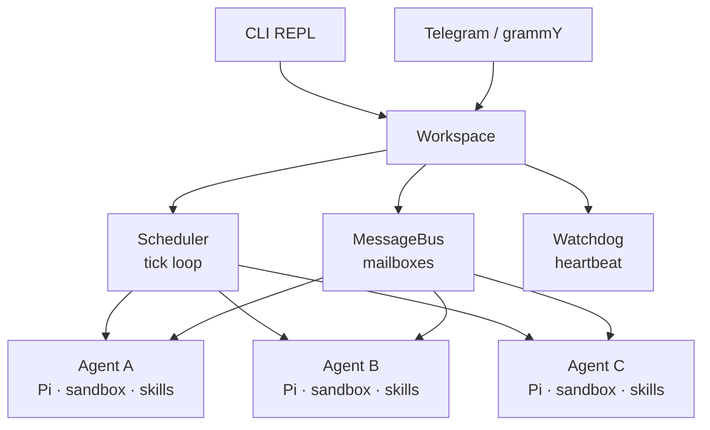

# pi-tests

FreeRTOS-inspired multi-agent workspace manager built on [Pi](https://github.com/nichochar/pi-mono). Spawns and orchestrates sandboxed AI agent instances with tick-based scheduling, priority queues, mailbox IPC, cross-agent file access, watchdog monitoring, and Telegram as a messaging frontend.

## Architecture



**Core flow:** CLI/Telegram -> Workspace -> Scheduler tick -> drain mailbox -> dispatch to Pi Agent -> agent runs tools -> response streamed to Telegram.

Each agent is a full Pi coding agent with its own filesystem sandbox, skills, and injected collaboration tools (`send_mail`, `list_agents`, `read_agent_file`). The scheduler runs a FreeRTOS-style tick loop that serves agents by priority, one message per tick per agent, non-blocking.

## Quick Start

```bash
pnpm install

# Configure .env
cp .env.example .env   # then fill in your keys

# Start the REPL
pnpm dev start

# With Telegram
pnpm dev start --telegram
```

Create a `.env` file with your provider keys:

```env
OPENAI_API_KEY=sk-...
# ANTHROPIC_API_KEY=sk-...
# GEMINI_API_KEY=...
# TELEGRAM_BOT_TOKEN=...
```

## REPL Commands

| Command | Description |
|---|---|
| `spawn <name> [options]` | Create a new agent |
| `list` | Show all agents with status table |
| `send <agent> <message>` | Queue a message for an agent |
| `kill <agent>` | Stop and remove an agent |
| `status` | Show scheduler, watchdog, and resource state |
| `route <chatId> <agent>` | Route a Telegram chat to an agent |
| `route list` | List all Telegram chat routes |
| `help` | Show available commands |
| `exit` | Shutdown |

### Spawn Options

```
spawn <name>
  --model <provider:id>     Model (default: anthropic:claude-sonnet-4-20250514)
  --priority <0-4>          0=IDLE, 1=LOW, 2=NORMAL, 3=HIGH, 4=CRITICAL
  --thinking <level>        off, minimal, low, medium, high, xhigh
  --cwd <path>              Custom workspace dir (default: ~/.pi-tests/agents/<name>/workspace)
  --desc <text>             Agent description (visible to other agents)
  --prompt <text>           Custom system prompt
```

## Agent Collaboration

Agents discover and communicate with each other autonomously through three built-in tools:

### `list_agents`

Discover all agents in the workspace with their name, status, workspace path, and description. Agents are instructed to call this first when given a task to find collaborators.

### `send_mail`

Send a message to another agent's mailbox. Messages are delivered on the next scheduler tick as a new prompt prefixed with `[Mail from sender]`. Use `__broadcast__` to message all agents.

```
copywriter calls send_mail:
  to: "designer"
  message: "Here's the landing page copy: ..."

→ Message lands in designer's mailbox
→ Next tick delivers it as: [Mail from copywriter]\nHere's the landing page copy: ...
→ Designer starts working
```

### `read_agent_file`

Read files directly from another agent's workspace without needing to ask them. Path traversal is blocked for security.

```
reviewer calls read_agent_file:
  agent: "designer"
  path: "index.html"

→ Returns contents of ~/.pi-tests/agents/designer/workspace/index.html
```

### Collaboration Prompt

Agents are prompted to:
- Always use `list_agents` first to discover collaborators
- Use `send_mail` for delegation and `read_agent_file` for code review
- Never ask the user for information another agent can provide
- Avoid reply loops — only send actionable messages, not pleasantries
- Report completion back to the user when all delegated work is done

## Telegram Integration

Connect a Telegram bot as a messaging frontend. All agent events (tool calls, text responses, completion) stream to the originating chat.

```bash
TELEGRAM_BOT_TOKEN=xxx pnpm dev start --telegram
```

### Telegram Commands

| Command | Description |
|---|---|
| `/agents` | List all running agents |
| `/help` | Show available commands |
| `@agentname message` | Send directly to a specific agent |
| *(plain text)* | Send to the default agent or routed agent |

Each agent's events route to the chat that triggered it, so multiple chats can interact with different agents concurrently.

## Concepts

### Tick-Based Scheduler

The scheduler runs a `setInterval` tick loop (default 2s). Each tick:

1. Sorts agents by priority (CRITICAL=4 first, IDLE=0 last)
2. Skips agents currently running (`status === "running"`)
3. Drains each agent's mailbox, delivers the highest-priority message
4. Dispatches non-blocking — all agents run concurrently via async I/O
5. Re-queues remaining messages for the next tick

```
--tick-interval <ms>    Configure via CLI flag (default: 2000)
```

### Priority Levels

| Level | Value | Use case |
|---|---|---|
| `IDLE` | 0 | Background tasks, monitoring |
| `LOW` | 1 | Review, optimization |
| `NORMAL` | 2 | Standard work (default) |
| `HIGH` | 3 | Primary agents, user-facing |
| `CRITICAL` | 4 | Urgent, time-sensitive |

Higher-priority agents are always served first. One message per tick per agent prevents starvation.

### Sandboxing

Each agent gets an isolated workspace:

```
~/.pi-tests/agents/
  designer/
    workspace/          # agent's cwd — all file tools scoped here
    skills/             # agent-specific skills
  reviewer/
    workspace/
    skills/
```

All file tools (read, write, edit, bash) are scoped to the agent's workspace directory. Agents can read each other's files via `read_agent_file` but cannot write to them.

### Skills

Markdown files with YAML frontmatter loaded from each agent's `skills/` directory and injected into the system prompt.

```bash
pnpm dev skill install designer npm:@anthropic/web-skills
pnpm dev skill list designer
pnpm dev skill remove designer npm:@anthropic/web-skills
```

### Watchdog

Periodic heartbeat checks (default: every 10s). If an agent's last heartbeat exceeds the stuck threshold (default: 120s), it aborts and re-initializes with a fresh Pi instance. Every agent event resets the heartbeat timer.

### Resource Guards

Mutex and semaphore primitives for coordinating shared resource access:

```ts
// Mutex — one holder at a time
const release = await workspace.mutex.acquire("database", "agent-a");
release();

// Semaphore — N concurrent holders
workspace.semaphore.create("api-rate-limit", 3);
const release = await workspace.semaphore.acquire("api-rate-limit");
release();
```

## End-to-End Example

Three agents collaborate on a landing page:

```
pi> spawn designer --model openai:gpt-5.2-codex --desc "Frontend designer — builds HTML/CSS"
pi> spawn copywriter --model openai:gpt-5.2-codex --desc "Copywriter — writes marketing copy"
pi> spawn reviewer --model openai:gpt-5.2-codex --desc "Code reviewer — reviews quality"
```

Via Telegram:
```
@copywriter Write landing page copy for FlowPilot, an AI task manager.
Include hero, 3 features, CTA. Send to designer when done.
```

What happens:
1. **copywriter** writes copy, uses `list_agents` to discover designer, sends via `send_mail`
2. **designer** receives mail, builds `index.html` with the copy
3. You send: `@reviewer Review designer's work and send feedback`
4. **reviewer** calls `list_agents`, uses `read_agent_file` to read designer's HTML, sends feedback via `send_mail`
5. **designer** applies fixes, **copywriter** reports completion to the user

All coordination is autonomous after the initial prompt.

## Project Structure

```
src/
  index.ts                CLI entry + REPL
  workspace.ts            Central facade
  types.ts                Shared types (Priority, AgentConfig, MailboxMessage, etc.)
  constants.ts            Shared constants (PI_TESTS_DIR)
  agent/
    handle.ts             Agent lifecycle (init, prompt, steer, abort, destroy)
    prompt.ts             Default system prompt builder
    tools/
      index.ts            Barrel re-export for all tools
      list-agents.ts      list_agents — discover agents in workspace
      read-agent-file.ts  read_agent_file — cross-agent file access
      send-mail.ts        send_mail — inter-agent mailbox messaging
  scheduler/
    scheduler.ts          Tick-based priority scheduler
    watchdog.ts           Heartbeat monitor + stuck detection
    resource-guard.ts     Mutex + Semaphore via async-mutex
  transport/
    local.ts              In-process priority mailbox queues
    message-bus.ts        Bus wrapper over transport
  bridges/
    telegram.ts           grammY Telegram bridge
  commands/
    spawn.ts              Agent creation with model/priority parsing
    list.ts               Agent status table
    send.ts               Message queueing
    kill.ts               Agent teardown
    status.ts             Scheduler/watchdog overview
    route.ts              Telegram chat routing
    skill.ts              Per-agent skill management
```

## Dependencies

| Package | Purpose |
|---|---|
| `@mariozechner/pi-agent-core` | Pi agent runtime |
| `@mariozechner/pi-coding-agent` | Sandboxed coding tools + skills |
| `@mariozechner/pi-ai` | Model registry + streaming |
| `@sinclair/typebox` | Tool parameter schemas |
| `async-mutex` | Mutex and semaphore primitives |
| `commander` | CLI argument parsing |
| `grammy` | Telegram Bot API |

## Development

```bash
pnpm install          # Install dependencies
pnpm build            # TypeScript type check (tsc --noEmit)
pnpm check            # ESLint (max 400 lines/file enforced)
pnpm test             # Run test suite (vitest)
pnpm test:watch       # Run tests in watch mode
pnpm dev start        # Run in dev mode (tsx)
```

Tests live in `test/` (one file per module, `<feature>.test.ts` naming).

Requires Node 22+.
