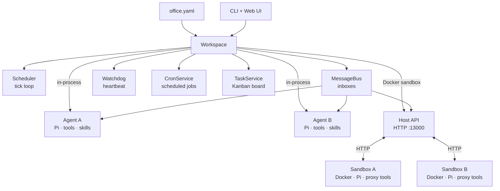

# agent-office

Multi-agent workspace manager built on [Pi](https://github.com/badlogic/pi-mono). Orchestrates AI coding agents — similar to Claude Code or OpenClaw — with tick-based scheduling, priority queues, inbox IPC, cross-agent file access, watchdog monitoring, proactive cron jobs, optional Docker sandbox isolation, and declarative YAML configuration.

## Get Started

Try one of these examples to get up and running quickly. Set env vars in the project root `.env` (not inside Docker — the host forwards them to containers).

**Basic team** — PM, coder, and reviewer:

```bash
pnpm install
cp .env.example .env
cp -r examples/basic-team/ ~/.agent-office/offices/basic-team/
pnpm dev start --office basic-team --sandbox docker
```

```env
GEMINI_API_KEY=
```

**OpenServ team** — idea scout, team lead, agent dev, and token launcher:

```bash
pnpm install
cp .env.example .env
mkdir -p ~/.agent-office/offices/openserv-team
cp examples/openserv-team/office.yaml ~/.agent-office/offices/openserv-team/office.yaml
pnpm dev start --office openserv-team --sandbox docker
```

```env
OPENAI_API_KEY=
WALLET_PRIVATE_KEY=          # EVM wallet key for openserv-labs/skills agents
```

**Feature team** — task-driven development with Kanban board:

```bash
cp -r examples/feature-team/ ~/.agent-office/offices/feature-team/
pnpm dev start --office feature-team
```

See [`examples/`](examples/) for more details — each has a README describing the setup.

## Table of Contents

- [Architecture](#architecture)
- [Quick Start](#quick-start)
- [Multi-Office Architecture](#multi-office-architecture)
  - [Creating an Office](#creating-an-office)
  - [Office Configuration](#office-configuration-officeyaml)
  - [Heartbeat](#heartbeat)
  - [Permissions](#permissions)
  - [Tool Policy](#tool-policy)
  - [Hierarchy](#hierarchy)
  - [Auto-Sync](#auto-sync)
  - [Reload](#reload)
  - [Cron Jobs](#cron-jobs)
  - [Office-Level Cron](#office-level-cron)
  - [Agent Cron Tools](#agent-cron-tools)
  - [Task Management](#task-management)
  - [Migration from agents.yaml](#migration-from-agentsyaml)
- [Sandbox Modes](#sandbox-modes)
  - [In-Process Mode](#in-process-mode-default)
  - [Docker Sandbox Mode](#docker-sandbox-mode)
- [Commands](#commands)
  - [Hire Options](#hire-options)
  - [CLI Flags](#cli-flags)
  - [Execution Surfaces](#execution-surfaces)
  - [REST API Endpoints](#rest-api-endpoints)
- [Agent Collaboration](#agent-collaboration)
  - [list_agents](#list_agents)
  - [message_agent](#message_agent)
  - [read_agent_file](#read_agent_file)
  - [authenticated_fetch](#authenticated_fetch)
  - [cron_add](#cron_add)
  - [cron_remove](#cron_remove)
  - [cron_list](#cron_list)
  - [read_skill](#read_skill)
  - [skill_search](#skill_search)
  - [skill_install](#skill_install)
  - [skill_remove](#skill_remove)
  - [skill_create](#skill_create)
  - [task_create](#task_create)
  - [task_update](#task_update)
  - [task_list](#task_list)
  - [task_get](#task_get)
  - [Collaboration Policy](#collaboration-policy)
  - [Obligation Tracking](#obligation-tracking)
  - [Deadlock Detection](#deadlock-detection)
  - [Collaboration Metrics](#collaboration-metrics)
  - [Tool Architecture](#tool-architecture)
  - [Prompt System](#prompt-system)
- [Memory System](#memory-system)
  - [memory_search](#memory_search)
  - [memory_get](#memory_get)
  - [Citation Mode](#citation-mode)

- [Concepts](#concepts)
  - [Tick-Based Scheduler](#tick-based-scheduler)
  - [Priority Levels](#priority-levels)
  - [Workspace Sandboxing](#workspace-sandboxing)
  - [Skills](#skills)
  - [Bootstrap Files](#bootstrap-files)
  - [Watchdog](#watchdog)
  - [Message Persistence](#message-persistence)
- [Prompt Inspection](#prompt-inspection)
- [Cost Tracking](#cost-tracking)
- [Web UI](#web-ui)
- [End-to-End Examples](#end-to-end-examples)
- [Project Structure](#project-structure)
- [Dependencies](#dependencies)
- [Development](#development)

## Architecture



**Core flow:** `office.yaml` (auto-spawn) / CLI / Web UI / Cron / Agent cron tools / Task notifications -> Workspace -> Scheduler tick -> drain inbox -> dispatch to Pi Agent -> agent runs tools -> response streamed to UI.

Each agent is a full Pi coding agent with its own filesystem workspace, skills, and injected tools (`message_agent`, `list_agents`, `read_agent_file`, `authenticated_fetch`, `memory_search`, `memory_get`, `cron_add`, `cron_remove`, `cron_list`, `task_create`, `task_update`, `task_list`, `task_get`, `read_skill`, `skill_search`, `skill_install`, `skill_remove`, `skill_create`). The scheduler runs a tick loop that serves agents by priority, one message per tick per agent, non-blocking.

Agents can run **in-process** (default) or inside **Docker containers** for full process-level isolation.

## Quick Start

```bash
pnpm install

# Configure .env
cp .env.example .env   # then fill in your keys

# Create an office
pnpm dev office create my-team

# Start (Web UI auto-starts)
pnpm dev start --office my-team

# Start with Docker sandbox isolation
pnpm dev start --office my-team --sandbox docker
```

Create a `.env` file with your provider keys:

```env
OPENAI_API_KEY=sk-...
# ANTHROPIC_API_KEY=sk-...
# GEMINI_API_KEY=...
# MY_GH_TOKEN=ghp_...           # Host env vars for secret refs (office.yaml secrets)
```

## Multi-Office Architecture

Each office represents a company or team with shared identity, env vars, and secrets. Offices live under `~/.agent-office/offices/<id>/`.

### Creating an Office

```bash
# Create with default display name (same as id)
pnpm dev office create acme

# Create with a custom display name
pnpm dev office create acme --name "Acme Corp"
```

Office IDs must be path-safe: lowercase letters, digits, hyphens, underscores (matching `[a-z0-9][a-z0-9_-]*`). The display name (`office.name` in YAML) is free-form.

### Office Configuration (`office.yaml`)

Define your office once in `~/.agent-office/offices/<id>/office.yaml` and agents auto-spawn on startup.

```yaml
# ~/.agent-office/offices/acme/office.yaml
office:
  name: Acme Corp
  description: "We build AI-powered widgets"
  env:
    SHARED_API_URL: https://api.acme.com
  secrets:
    SHARED_TOKEN: ${ACME_TOKEN}
  memory:
    citations: auto # on | off | auto (default: auto)
  cron:
    standup:
      schedule: "0 9 * * 1-5"
      message: "Run standup"
      targets: [pm, coder]
  collaborationPolicy:
    mode: off # off | warn | enforce
    sla:
      replyByMinutes: 5
      remindAtMinutes: 3
      escalateAtMinutes: 5
      staleTaskHours: 24
      deadlockThresholdMinutes: 10
      stallCooldownMinutes: 5

agents:
  designer:
    model: anthropic:claude-sonnet-4-20250514
    priority: normal # idle | low | normal | high | critical (or 0-4)
    thinking: low # off | minimal | low | medium | high | xhigh
    description: "Frontend designer — builds HTML/CSS"
    prompt_inline: |
      You are a frontend designer specializing in responsive layouts.
      Focus on clean, semantic HTML and modern CSS.
    skills:
      - nichochar/web-skills
    api_key_ref: MY_CUSTOM_KEY # optional — host env var name for model key override
    env: # non-sensitive, passed as Docker --env (agent overrides office)
      LOG_LEVEL: debug
      WORKSPACE_NAME: designer
    secrets: # sensitive, ${VAR} refs only — delivered via authenticated_fetch
      GITHUB_TOKEN: ${MY_GH_TOKEN}
    disclose_secrets: true # show secret names in system prompt (default: false)
    permissions:
      office_cron: true # allow managing office-level cron jobs

  reviewer:
    model: openai:gpt-4.1
    priority: high
    thinking: medium
    description: "Code reviewer"
```

Office-level `env` and `secrets` are inherited by all agents. Agent-level values override office-level.

The `collaborationPolicy` block configures collaboration enforcement for all agents. See [Collaboration Policy](#collaboration-policy).

All agent fields are optional. Agents are spawned sequentially in declaration order; if one fails, the rest still start. Model availability depends on your provider account — replace the `model` value with your preferred `provider:model-id` if the default is unavailable.

| Field              | Type             | Default                                                | Description                                                                      |
| ------------------ | ---------------- | ------------------------------------------------------ | -------------------------------------------------------------------------------- |
| `model`            | string           | `anthropic:claude-sonnet-4-20250514`                   | `provider:model-id`                                                              |
| `priority`         | string \| number | `normal`                                               | Priority name or 0-4                                                             |
| `thinking`         | string           | `low`                                                  | `off` / `minimal` / `low` / `medium` / `high` / `xhigh`                          |
| `description`      | string           | `""`                                                   | Visible to other agents                                                          |
| `prompt_inline`    | string           | _(none)_                                               | Custom instructions (inline text, appended to base prompt)                       |
| `prompt_file`      | string           | _(none)_                                               | Path to `.md` file with custom instructions (relative to office dir)             |
| `bootstrap_dir`    | string           | `agents/<name>/bootstrap/`                             | Bootstrap file source directory (relative to office dir)                         |
| `cwd`              | string           | `~/.agent-office/offices/<id>/agents/<name>/workspace` | Working directory                                                                |
| `skills`           | string[]         | `[]`                                                   | GitHub sources to auto-install (`owner/repo`)                                    |
| `api_key_ref`      | string           | _(auto from provider)_                                 | Host env var name for model API key                                              |
| `env`              | map              | `{}`                                                   | Non-sensitive env vars (Docker `--env`, supports `${VAR}` refs)                  |
| `secrets`          | map              | `{}`                                                   | Secret refs in `${VAR}` format (delivered via `authenticated_fetch`)             |
| `disclose_secrets` | boolean          | `false`                                                | Show secret names in system prompt                                               |
| `cron`             | map              | `{}`                                                   | Named cron jobs (see [Cron Jobs](#cron-jobs))                                    |
| `reports_to`       | string           | _(none — reports to user)_                             | Name of manager agent (see [Hierarchy](#hierarchy))                              |
| `permissions`      | map              | `{}`                                                   | Agent permissions (see [Permissions](#permissions), [Tool Policy](#tool-policy)) |
| `prompt_mode`      | string           | `"full"`                                               | `full` (all blocks) or `minimal` (base + identity + custom only)                 |
| `on_demand_skills` | boolean          | `true`                                                 | Advertise skill summaries; load full content on demand via `read_skill`          |
| `heartbeat`        | map              | _(none)_                                               | Proactive heartbeat config (see [Heartbeat](#heartbeat))                         |

**Task tools** (`task_create`, `task_update`, `task_list`, `task_get`) are available to all in-process agents by default. Restrict access via `permissions.tools.deny`. See [Task Management](#task-management).

#### Heartbeat

Agents can run proactively via heartbeats — periodic messages that prompt agents to check for work or run maintenance without external triggers.

```yaml
agents:
  monitor:
    heartbeat:
      interval_ms: 60000
      prompt: "Check for pending work and report status"
      active_hours:
        start: "09:00"
        end: "17:00"
```

| Field          | Required | Default     | Description                                 |
| -------------- | -------- | ----------- | ------------------------------------------- |
| `interval_ms`  | yes      | —           | Interval in milliseconds between heartbeats |
| `prompt`       | no       | _(default)_ | Custom prompt text for heartbeat messages   |
| `active_hours` | no       | _(none)_    | Restrict heartbeats to a time window        |

Heartbeat messages are injected with `from: "__heartbeat__"` and formatted as `[Heartbeat]\n<prompt>`. Busy agents (status `running`) are skipped.

### Permissions

The `permissions` field controls which privileged operations an agent may perform:

| Permission    | Type    | Default | Description                                                        |
| ------------- | ------- | ------- | ------------------------------------------------------------------ |
| `office_cron` | boolean | `false` | Allow managing office-level cron jobs via `cron_add`/`cron_remove` |

Permissions are validated at config parse time. Unknown keys or non-boolean values are rejected.

### Tool Policy

The `permissions.tools` field restricts which tools an agent may use:

```yaml
agents:
  restricted-bot:
    permissions:
      tools:
        deny: [cron_add, cron_remove] # blacklist — all except these
        # OR
        # allow: [message_agent, list_agents]  # whitelist — only these
```

- **`deny`** — blacklist: agent has all tools except the listed ones.
- **`allow`** — whitelist: agent has only the listed tools.
- Cannot specify both `allow` and `deny` — validation error at parse time.
- Default (no `tools` field): all tools available.
- **Server-side enforcement:** in Docker sandbox mode, denied tools also return HTTP 403 on the corresponding Host API endpoint (e.g. `/api/cron-add` returns `403 Tool denied by policy`).

### Permission Management

Defaults: `office_cron` is **false**; tools are **all allowed** unless `allow` or `deny` is set. Setting both `allow` and `deny` is a validation error.

View permissions in the Web UI or edit via the API without editing YAML manually:

```bash
agent permission show bot
agent permission set bot office_cron true
agent permission set bot tools deny cron_add,cron_remove
agent permission clear bot office_cron
agent permission clear bot tools
```

Changes are saved to `office.yaml`. Run `office reload --force` to apply.

### Hierarchy

The `reports_to` field defines a manager for each agent, creating an org tree. Agents without `reports_to` report directly to the user. The hierarchy is injected into the system prompt so each agent knows its manager, peers, and direct reports.

```yaml
agents:
  lead:
    description: "Team lead"
  coder:
    reports_to: lead
  reviewer:
    reports_to: lead
```

Validation rules:

- Must reference a valid agent name (same `[a-zA-Z0-9_-]+` format)
- Self-reference is rejected
- Cycles are detected and rejected (e.g. A reports to B, B reports to A)
- Unknown agent references are rejected

Hierarchy changes trigger agent restarts (prompts are recomposed with updated context).

### Auto-Sync

Commands automatically keep `office.yaml` in sync:

- **`hire`** persists the agent to YAML (use `--ephemeral` to skip)
- **`fire`** removes the agent from YAML
- **`skill add/remove`** updates the agent's `skills` array in YAML (GitHub source model)

`skills.sh` package installs (`skill_search` / `skill_install` tools or UI install) write files under `agents/<agent>/skills` but do not auto-edit `office.yaml`.

All writes are atomic (temp file + rename) and serialized through a two-layer lock (in-process queue + cross-process file lock) per office.

### Reload

```bash
# API command strings (UI has equivalent controls):
office reload              # Spawn new agents from YAML, skip already-running
office reload --force      # Kill and re-spawn agents with changed config
office validate            # Dry-run: parse + validate without spawning
office path                # Print path to office.yaml
```

### Cron Jobs

Agents can run proactively on schedules via per-agent cron jobs. The host-side `CronService` manages timers and injects messages into the bus with `from: "__cron__"` — agents never see cron internals.

```yaml
# In office.yaml under the agents section:
agents:
  standup-bot:
    model: anthropic:claude-sonnet-4-20250514
    cron:
      daily-standup:
        schedule: "0 9 * * 1-5" # 5-field only (min hour dom month dow)
        message: "Run the daily standup"
        timezone: "America/New_York" # optional, default UTC
        catch_up: once # optional: "skip" (default) | "once"
        enabled: true # optional, default true
        report_channel: general # optional, post trigger to this channel
```

| Field            | Required | Default  | Description                                                                 |
| ---------------- | -------- | -------- | --------------------------------------------------------------------------- |
| `schedule`       | yes      | —        | 5-field cron expression (`@daily`/`@hourly` rejected)                       |
| `message`        | yes      | —        | Prompt text sent to the agent                                               |
| `timezone`       | no       | `UTC`    | IANA timezone for schedule evaluation                                       |
| `catch_up`       | no       | `skip`   | `skip` = ignore missed fires on restart; `once` = fire one catch-up message |
| `enabled`        | no       | `true`   | Set `false` to pause without removing                                       |
| `report_channel` | no       | _(none)_ | Channel name to post the cron trigger to (visible in channel session)       |

Job names must match `[a-zA-Z0-9_-]+`. Each agent can have 0-N named jobs.

**Catch-up behavior:** On restart, if `catch_up: once` and a fire was missed since the last run, one immediate message is sent. First-ever run (no prior state) never catches up. State persists to `~/.agent-office/offices/<id>/cron/state.json`.

**Safety guards:** Busy agents (status `running`) are skipped. A global dispatch cap of 60 cron messages per minute prevents misconfigured schedules from flooding the bus.

#### Cron Commands

```bash
# API command strings (UI has equivalent controls):
cron list                                          # List all cron jobs
cron status [agent]                                # Detailed job status
cron add <agent> <job> "<schedule>" <message> [--apply]   # Add a job
cron remove <agent> <job> [--apply]                # Remove a job
cron trigger <agent> <job>                         # Fire immediately
cron enable <agent> <job> [--apply]                # Re-enable a paused job
cron disable <agent> <job> [--apply]               # Pause a job
```

Without `--apply`, commands write to `office.yaml` only — run `office reload` to activate. With `--apply`, changes take effect immediately if the agent is running.

Change detection uses normalized config comparison (resolved model, numeric priority, sorted skills, trimmed prompt) so cosmetic YAML differences like `normal` vs `2` or reordered skills don't trigger false warnings.

#### Office-Level Cron

In addition to per-agent cron, you can define office-level cron jobs that dispatch messages to one or more target agents:

```yaml
# In office.yaml under the office section:
office:
  cron:
    standup:
      schedule: "0 9 * * 1-5"
      message: "Report your status for today's standup"
      targets: [pm, coder, reviewer]
      timezone: "America/New_York"
    weekly-review:
      schedule: "0 17 * * 5"
      message: "Summarize this week's progress"
      targets: [__broadcast__] # sends to all agents
```

| Field            | Required | Default  | Description                                                                 |
| ---------------- | -------- | -------- | --------------------------------------------------------------------------- |
| `schedule`       | yes      | —        | 5-field cron expression                                                     |
| `message`        | yes      | —        | Prompt text sent to each target agent                                       |
| `targets`        | yes      | —        | Agent names or `__broadcast__` (all agents)                                 |
| `timezone`       | no       | `UTC`    | IANA timezone for schedule evaluation                                       |
| `catch_up`       | no       | `skip`   | `skip` = ignore missed fires on restart; `once` = fire one catch-up message |
| `enabled`        | no       | `true`   | Set `false` to pause without removing                                       |
| `report_channel` | no       | _(none)_ | Channel name to post the cron trigger to (visible in channel session)       |

Target agent names are validated at parse time. Typos fail fast:

```
[office] office.cron.standup: unknown target agent "codre"
```

**Activation:** YAML edits require `office reload` to take effect. Commands with `--apply` take effect immediately.

Office cron commands:

```bash
cron add office <job> "<schedule>" <message> --targets pm,coder
cron remove office <job>
cron trigger office <job>                    # fire immediately
```

Office jobs appear in `cron list` with an `[office]` scope tag. The same safety guards apply: busy agents are skipped, and the global 60/minute dispatch cap counts each target dispatch.

#### Agent Cron Tools

In addition to operator-managed cron (Web UI/API), agents can self-manage cron jobs via three built-in tools: `cron_add`, `cron_remove`, and `cron_list`. `cron_trigger` remains operator-only.

**Agent scope** (default) — agents manage their own jobs with no special permission. Max 10 jobs per agent.

```
agent calls cron_add:
  name: "nightly-report"
  schedule: "0 22 * * *"
  message: "Generate the nightly summary report"

-> Cron job "nightly-report" saved and activated (At 10:00 PM).
```

**Office scope** — requires `permissions: { office_cron: true }` in office.yaml. The `targets` field is required.

```
agent calls cron_add:
  name: "standup"
  schedule: "0 9 * * 1-5"
  message: "Report your status"
  scope: "office"
  targets: ["pm", "coder"]

-> Cron job "standup" saved and activated (At 09:00 AM, Monday through Friday).
```

**Visibility:** `cron_list` shows all office-level jobs plus only the calling agent's own agent-scope jobs. No cross-agent visibility.

**Error handling:** Malformed or invalid `office.yaml` returns a tool error — no silent success. Validation errors (bad schedule, unknown targets), parse failures, and permission denials all produce explicit error messages.

**Audit trail:** Every action (success, denial, or error) is logged to `<officeDir>/logs/cron-audit.jsonl` and printed to stdout with `[cron-audit]` prefix.

**Security:** Agent-scope writes are isolated to the calling agent's YAML section (identity derived from auth token). All mutations run under `withOfficeLock` with race-free activation from the same parsed document.

### Task Management

Agents can create, assign, and track tasks through a shared Kanban-style task system. The `TaskService` manages task state, enforces status transitions, resolves dependency chains, and dispatches notifications via the message bus.

Task tools (`task_create`, `task_update`, `task_list`, `task_get`) are registered as default tools for all agents. Restrict access per agent via `permissions.tools.deny`. Task proxy endpoints are available via Host API.

#### Task Lifecycle

Tasks follow a Kanban status flow with enforced transitions:

```
backlog → todo → in_progress → review → done
                                  ↓
                              cancelled
```

| Status        | Allowed transitions                |
| ------------- | ---------------------------------- |
| `backlog`     | `todo`, `cancelled`                |
| `todo`        | `in_progress`, `cancelled`         |
| `in_progress` | `review`, `done`, `cancelled`      |
| `review`      | `in_progress`, `done`, `cancelled` |
| `done`        | _(terminal)_                       |
| `cancelled`   | `backlog`                          |

**Dependency behavior:** Tasks created with `dependsOn` start in `backlog` regardless of the requested status. When all dependencies reach `done`, the `TaskService` auto-transitions the blocked task to `todo` and sends a `[Task Ready]` notification to the assignee.

**Notifications:** New task assignments dispatch `[New Task]` messages. Dependency resolution dispatches `[Task Ready]` messages. Both are sent from `__task__` via the message bus.
The message bus applies a dedicated higher limit for `__task__` notifications (`40` messages / `30s`) so task events are less likely to be dropped under bursty updates.

**Audit trail:** All task mutations are logged to `<officeDir>/logs/task-audit.jsonl`.

**Persistence:** Task state is stored at `<officeDir>/tasks/tasks.json`.

#### Task Agent Tools

Agents interact with tasks via four built-in tools:

```
agent calls task_create:
  title: "Implement login page"
  description: "Build login form with email/password fields and validation"
  assignee: "coder"
  dependsOn: []

-> Created task T-a1b2c3 (status: todo)
-> [New Task] notification sent to coder
```

```
agent calls task_update:
  id: "T-a1b2c3"
  status: "done"
  result: "Implemented login with email/password auth"

-> Task T-a1b2c3 updated to done
-> Dependent tasks auto-transition to todo
```

```
agent calls task_list:
  assignee: "coder"
  status: "in_progress"

-> Returns filtered list of tasks
```

```
agent calls task_get:
  id: "T-a1b2c3"

-> Returns full task details (title, description, status, assignee, dependencies, timestamps)
```

#### Task Commands

```bash
task list [--assignee <agent>] [--status <status>]   # List/filter tasks
task board                                            # Kanban board view
task get <id>                                         # Show task details
```

#### Kanban Board

The Web UI includes a Kanban board accessible from the sidebar "Tasks" item. Columns: backlog, todo, in_progress, review, done. Filter by agent using the segmented control. Click a task card to view full details.

### Migration from `agents.yaml`

If you have a legacy `~/.agent-office/agents.yaml`, migrate to the multi-office format:

```bash
# Preview what will happen
pnpm dev office migrate --name my-team --dry-run

# Run the migration (copies data, renames agents.yaml → agents.yaml.bak)
pnpm dev office migrate --name my-team

# Verify everything works
pnpm dev start --office my-team

# Clean up old files (prompts for confirmation)
pnpm dev office migrate --name my-team --finalize
```

Starting with a legacy `agents.yaml` present will fail with a migration prompt.

## Sandbox Modes

agent-office supports two execution modes for agents:

### In-Process Mode (default)

```bash
pnpm dev start --office my-team                  # or explicitly:
pnpm dev start --office my-team --sandbox none
```

Agents run in the same Node.js process as the scheduler. Simple, fast, zero setup. Tools call directly into the message bus and filesystem.

**Best for:** development, single-user setups, trusted agent code.

### Docker Sandbox Mode

```bash
pnpm dev start --office my-team --sandbox docker
```

Each agent runs inside an isolated Docker container with hardened security. Agents communicate with the host via HTTP through the Host API.

**Best for:** untrusted agent code, multi-tenant environments, production deployments.

**Requirements:** Docker must be installed and running.

**Build tooling:** The sandbox image includes `python3`, `make`, and `g++` so agents can `npm install` packages with native addons (node-gyp).

#### How Docker Sandbox Works

```
Host Process                        Docker Container (per agent)
+---------------------------+       +-----------------------------+
| Workspace                 |       | sandbox-entry.ts            |
| Scheduler + MessageBus    |       | Pi Agent + coding tools     |
| Host API server (:13000)  |<-HTTP>| Proxy tools (HTTP->Host)    |
| DockerProvider            |       | HTTP server (:3100)         |
| Watchdog                  |       | Heartbeat loop (5s)         |
+---------------------------+       +-----------------------------+
```

1. **Workspace** generates a unique auth token per agent and registers it with the Host API.
2. **DockerProvider** builds the `pi-sandbox` Docker image (once), then runs a container per agent with:
   - `--cap-drop=ALL` — no Linux capabilities
   - `--security-opt no-new-privileges` — no privilege escalation
   - `--user 1000:1000` — non-root user
   - Volume mount: host workspace directory -> `/workspace` in container
3. **sandbox-entry.ts** (inside container) creates a Pi Agent with:
   - Local coding tools (read, write, edit, bash, grep, find, ls) scoped to `/workspace`
   - Proxy tools that forward `message_agent`, `list_agents`, `read_agent_file`, `authenticated_fetch`, `memory_search`, `memory_get`, `task_create`, `task_update`, `task_list`, `task_get`, `read_skill`, `skill_search`, `skill_install`, `skill_remove`, `skill_create` to the Host API over HTTP
4. **Host API** authenticates requests via Bearer token, executes them against the message bus / filesystem, and returns results.
5. **Prompt flow:** Host sends `POST /prompt` to container -> agent processes -> container sends `POST /api/prompt-done` back to host.
6. **Heartbeat:** Container sends `POST /api/heartbeat` every 5 seconds. Watchdog monitors these for stuck detection.

#### Docker Sandbox Security Model

| Protection              | Mechanism                                                                                             |
| ----------------------- | ----------------------------------------------------------------------------------------------------- |
| Process isolation       | Separate Docker container per agent                                                                   |
| No root access          | `--user 1000:1000`, `--cap-drop=ALL`, `no-new-privileges`                                             |
| Filesystem isolation    | Only the agent's own workspace is mounted                                                             |
| Secret isolation        | Model API key via `GET /api/secrets` (memory-only, never in Docker env)                               |
| Tool secret isolation   | Per-agent secrets resolved host-side via `authenticated_fetch` — never enter container                |
| Output redaction        | Two-layer: sandbox-side + host-side redaction of secrets in events and fetch responses                |
| SSRF protection         | Two-layer: literal IP check + DNS resolution (blocks private, loopback, link-local, IPv4-mapped IPv6) |
| Cross-agent file access | Proxied through Host API with path traversal guards                                                   |
| Authentication          | Unique per-agent Bearer token on all endpoints (except `/health`)                                     |
| Message integrity       | Server derives sender identity from token, never trusts body                                          |
| Idempotency             | `messageId`-based deduplication with 5-minute TTL                                                     |
| Request limits          | 64 KB message-agent body, 1 MB general body, 1 MB file response                                       |
| Prompt timeout          | 5-minute timeout on prompt completion                                                                 |

#### Docker Sandbox Example

```bash
# Terminal 1: Start with Docker sandbox
pnpm dev start --office acme --sandbox docker

# API command strings (UI has equivalent controls):
hire designer --model anthropic:claude-sonnet-4-20250514 --desc "Frontend designer"
# → [agent:designer] Started in sandbox (http://localhost:13100)

hire reviewer --model openai:gpt-4.1 --desc "Code reviewer"
# → [agent:reviewer] Started in sandbox (http://localhost:13101)

send designer "Create a responsive landing page with hero section"
# → designer works inside its Docker container, edits files in /workspace
# → Files persist at ~/.agent-office/offices/acme/agents/designer/workspace/ on the host

send reviewer "Review designer's index.html and send feedback"
# → reviewer uses read_agent_file (proxied via Host API) to read designer's files
# → reviewer uses message_agent (proxied via Host API) to send feedback to designer
```

Verify files created by sandboxed agents persist on the host:

```bash
ls ~/.agent-office/offices/acme/agents/designer/workspace/
# index.html  styles.css  ...
```

#### Host API Endpoints

The Host API runs on port 13000 (configurable) and provides the bridge between sandboxed agents and the host system.

| Method | Path                             | Purpose                                                        |
| ------ | -------------------------------- | -------------------------------------------------------------- |
| `GET`  | `/api/secrets`                   | Fetch secrets (model API key + tool secrets) at container boot |
| `POST` | `/api/message-agent`             | Forward message to another agent's inbox                       |
| `GET`  | `/api/agents`                    | List all agents (name, status, description)                    |
| `GET`  | `/api/agent-file?agent=X&path=Y` | Read file from another agent's workspace                       |
| `POST` | `/api/authenticated-fetch`       | Host-proxied HTTP request with secret injection                |
| `POST` | `/api/memory-search`             | Search memory files across scopes (auth required)              |
| `POST` | `/api/memory-get`                | Read a specific memory file (auth required)                    |
| `POST` | `/api/cron-add`                  | Add or update a cron job (auth required, identity from token)  |
| `POST` | `/api/cron-remove`               | Remove a cron job (auth required, identity from token)         |
| `POST` | `/api/cron-list`                 | List cron jobs visible to the calling agent (auth required)    |
| `POST` | `/api/prompt-done`               | Notify host that a prompt completed                            |
| `POST` | `/api/agent-event`               | Forward agent events to host (redacted)                        |
| `POST` | `/api/heartbeat`                 | Update agent heartbeat timestamp                               |
| `POST` | `/api/task-create`               | Create a task (auth required)                                  |
| `POST` | `/api/task-update`               | Update a task (auth required)                                  |
| `POST` | `/api/task-list`                 | List tasks (auth required)                                     |
| `POST` | `/api/task-get`                  | Get task details (auth required)                               |
| `POST` | `/api/read-skill`                | Read full skill content (auth required)                        |
| `POST` | `/api/skill-search`              | Search skills registry (auth required)                         |
| `POST` | `/api/skill-install`             | Install a skill from registry (auth required)                  |
| `POST` | `/api/skill-remove`              | Remove an installed skill (auth required)                      |
| `POST` | `/api/skill-create`              | Create a custom skill (auth required)                          |
| `POST` | `/api/tool-count`                | Report agent tool count (auth required)                        |

All endpoints require `Authorization: Bearer <token>` header. The token is generated per agent by the host and injected into the container as an environment variable. Model API keys are never passed as Docker env vars — they are fetched via `GET /api/secrets` at boot and stored in memory only.

## Commands

Runtime operations are available through two surfaces:

- **Typed REST API** — dedicated endpoints for each operation (e.g. `POST /api/agents` to hire, `DELETE /api/agents/:name` to fire, `PATCH /api/agents/:name/prompt` to update prompt). See [REST API Endpoints](#rest-api-endpoints) for the full list.
- **`POST /api/send`** — structured endpoint for sending messages to agents (`{ "agent": "<name>", "message": "<text>" }`).

The Web UI has dedicated controls (buttons, forms, modals) for common operations — hire, fire, send, cron, reload — that call these typed endpoints internally.

The table below lists all available operations and their descriptions:

| Command                                               | Description                                                   |
| ----------------------------------------------------- | ------------------------------------------------------------- |
| `hire <name> [options]`                               | Create a new agent (persists to YAML unless `--ephemeral`)    |
| `roster`                                              | Show all agents with status table                             |
| `send <agent> <message>`                              | Queue a message for an agent                                  |
| `fire <agent>`                                        | Stop and remove an agent (removes from YAML)                  |
| `status`                                              | Show scheduler, watchdog, and resource state                  |
| `skill add <agent> <source>`                          | Install skills from GitHub source (`owner/repo`, legacy flow) |
| `skill list <agent>`                                  | List installed skills                                         |
| `skill remove <agent> <name>`                         | Remove a legacy GitHub-source skill                           |
| `agent env set <agent> <KEY> <VALUE>`                 | Set env var in `office.yaml`                                  |
| `agent env unset <agent> <KEY>`                       | Remove env var from `office.yaml`                             |
| `agent secret-ref set <agent> <KEY> <ENV>`            | Set secret ref in `office.yaml`                               |
| `agent secret-ref unset <agent> <KEY>`                | Remove secret ref from `office.yaml`                          |
| `agent config show <agent>`                           | Show agent config (secrets redacted)                          |
| `agent prompt show <agent>`                           | Show effective prompt (version/hash)                          |
| `agent prompt set <agent> <text>`                     | Set custom prompt (`prompt_inline` only)                      |
| `agent prompt append <agent> <text>`                  | Append to custom prompt (`prompt_inline` only)                |
| `agent prompt clear <agent>`                          | Remove prompt config (both inline and file ref)               |
| `agent permission show <agent>`                       | Show agent permissions (office_cron, tools)                   |
| `agent permission set <agent> office_cron <bool>`     | Set `office_cron` permission (true/false)                     |
| `agent permission set <agent> tools allow\|deny <t>`  | Set tools allow/deny list (comma-separated)                   |
| `agent permission clear <agent> office_cron`          | Clear `office_cron` permission                                |
| `agent permission clear <agent> tools`                | Clear tools permissions                                       |
| `agent hierarchy show <agent>`                        | Show agent's manager, peers, and direct reports               |
| `org chart`                                           | Display full org tree (user at root)                          |
| `office reload [--force]`                             | Re-apply `office.yaml` (force kills changed agents)           |
| `office validate`                                     | Dry-run: parse + validate YAML without spawning               |
| `office path`                                         | Print path to `office.yaml`                                   |
| `cron list`                                           | List all cron jobs                                            |
| `cron status [agent]`                                 | Detailed cron job status                                      |
| `cron add <agent> <job> "<sched>" <msg> [--apply]`    | Add a cron job                                                |
| `cron remove <agent> <job> [--apply]`                 | Remove a cron job                                             |
| `cron trigger <agent> <job>`                          | Fire a cron job immediately                                   |
| `cron enable <agent> <job> [--apply]`                 | Re-enable a paused job                                        |
| `cron disable <agent> <job> [--apply]`                | Pause a cron job                                              |
| `cron add office <job> "<sched>" <msg> --targets a,b` | Add an office-level cron job (applies immediately)            |
| `cron remove office <job>`                            | Remove an office-level cron job (applies immediately)         |
| `cron trigger office <job>`                           | Fire an office cron job immediately                           |
| `task list [--assignee X] [--status S]`               | List tasks with optional filters                              |
| `task board`                                          | Show Kanban board view                                        |
| `task get <id>`                                       | Show task details                                             |
| `prompt report <agent>`                               | Show prompt composition (block sizes, tool count, mode)       |
| `cost status`                                         | Session token and cost totals (resets on restart)             |
| `cost today [--agent <name>]`                         | Persistent token and cost totals for today                    |
| `cost report --days <n> [--agent <name>]`             | Historical usage over last N days                             |

### Hire Options

```
hire <name>
  --model <provider:id>     Model (default: anthropic:claude-sonnet-4-20250514)
  --priority <0-4>          0=IDLE, 1=LOW, 2=NORMAL, 3=HIGH, 4=CRITICAL
  --thinking <level>        off, minimal, low, medium, high, xhigh
  --cwd <path>              Custom workspace dir
  --desc <text>             Agent description (visible to other agents)
  --prompt <text>           Custom system prompt
  --api-key-ref <ENV_NAME>  Host env var for model API key override
  --env <KEY=VALUE>         Non-sensitive env var (repeatable)
  --secret-ref <KEY=ENV>    Secret ref mapping (repeatable)
  --ephemeral               Don't persist to office.yaml
```

### CLI Flags

```
pnpm dev start
  --office <name>           Office to load (required)
  --tick-interval <ms>      Scheduler tick interval (default: 2000)
  --sandbox <mode>          Sandbox mode: none | docker (default: none)
  --no-ui                   Run headless without the web UI
```

> **Migration note:** The interactive `ao>` REPL has been removed. All runtime commands are now available through the Web UI controls and typed REST API endpoints. Use `--no-ui` for headless operation; send `SIGINT`/`SIGTERM` to shut down.

### Execution Surfaces

Runtime commands (everything in the table above) can be executed through two surfaces:

- **Web UI** — dedicated controls (buttons, forms, modals) for common operations: hire, fire, send messages, cron management, office reload, org chart. Some data (tasks, cost, permissions, skills) is displayed read-only. There is no free-text command prompt in the UI.
- **REST API** — typed endpoints per resource (e.g. `POST /api/agents`, `DELETE /api/agents/:name`, `PATCH /api/agents/:name/prompt`), plus `POST /api/send` for agent messages. Callable via `curl`, scripts, or browser DevTools. See [REST API Endpoints](#rest-api-endpoints).

One-shot CLI commands (`office create`, `office validate`, `office migrate`, `start`) are run in the terminal and are not part of the runtime API.

With `--no-ui`, the dashboard and API server are not started — runtime commands are unavailable for that process.

### REST API Endpoints

The Web UI server exposes typed REST endpoints for all operations. All mutating endpoints require session cookie + CSRF headers (`Origin` + `X-Requested-With: XMLHttpRequest`).

**Auth & SSE:**

| Method | Path             | Description                                    |
| ------ | ---------------- | ---------------------------------------------- |
| `POST` | `/api/auth`      | Authenticate with bootstrap token, set session |
| `GET`  | `/api/events`    | SSE event stream (real-time updates)           |
| `GET`  | `/api/state`     | Full workspace state snapshot                  |
| `GET`  | `/api/status`    | Scheduler and agent status overview            |
| `GET`  | `/api/hierarchy` | Org chart hierarchy data                       |
| `GET`  | `/api/manifest`  | UI build manifest                              |

**Agents:**

| Method   | Path                               | Description                        |
| -------- | ---------------------------------- | ---------------------------------- |
| `POST`   | `/api/agents`                      | Hire a new agent                   |
| `GET`    | `/api/agents/:name`                | Get agent details                  |
| `DELETE` | `/api/agents/:name`                | Fire an agent                      |
| `POST`   | `/api/send`                        | Send a message to an agent         |
| `GET`    | `/api/agents/:name/inbox`          | Get agent inbox queue              |
| `GET`    | `/api/agents/:name/messages`       | Get agent DM history               |
| `DELETE` | `/api/agents/:name/messages`       | Clear agent DM history             |
| `GET`    | `/api/agents/:name/files`          | List agent workspace files         |
| `GET`    | `/api/agents/:name/files/content`  | Read a file from agent workspace   |
| `PATCH`  | `/api/agents/:name/prompt`         | Set, append, or clear agent prompt |
| `PATCH`  | `/api/agents/:name/permissions`    | Update agent permissions           |
| `PATCH`  | `/api/agents/:name/env`            | Set or unset agent env var         |
| `PATCH`  | `/api/agents/:name/secret-refs`    | Set or unset agent secret ref      |
| `PATCH`  | `/api/agents/:name/manager`        | Set or clear agent manager         |
| `PATCH`  | `/api/agents/:name/heartbeat`      | Set agent heartbeat config         |
| `DELETE` | `/api/agents/:name/heartbeat`      | Clear agent heartbeat config       |
| `GET`    | `/api/agents/:name/skills`         | List agent installed skills        |
| `GET`    | `/api/agents/:name/skills/search`  | Search skills registry             |
| `POST`   | `/api/agents/:name/skills/install` | Install a skill for an agent       |
| `DELETE` | `/api/agents/:name/skills/:skill`  | Remove an installed skill          |

**Cron:**

| Method   | Path                                  | Description                         |
| -------- | ------------------------------------- | ----------------------------------- |
| `GET`    | `/api/cron`                           | List all cron jobs                  |
| `POST`   | `/api/agents/:name/cron`              | Add a cron job for an agent         |
| `DELETE` | `/api/agents/:name/cron/:job`         | Remove an agent cron job            |
| `PATCH`  | `/api/agents/:name/cron/:job`         | Enable or disable an agent cron job |
| `POST`   | `/api/agents/:name/cron/:job/trigger` | Trigger an agent cron job           |
| `POST`   | `/api/cron/office`                    | Add an office-level cron job        |
| `DELETE` | `/api/cron/office/:job`               | Remove an office-level cron job     |
| `POST`   | `/api/cron/office/:job/trigger`       | Trigger an office-level cron job    |

**Tasks:**

| Method  | Path               | Description             |
| ------- | ------------------ | ----------------------- |
| `GET`   | `/api/tasks`       | List tasks with filters |
| `POST`  | `/api/tasks`       | Create a task           |
| `GET`   | `/api/tasks/board` | Get Kanban board data   |
| `GET`   | `/api/tasks/:id`   | Get task details        |
| `PATCH` | `/api/tasks/:id`   | Update task status/data |

**Channels:**

| Method   | Path                           | Description                 |
| -------- | ------------------------------ | --------------------------- |
| `POST`   | `/api/channels`                | Create a channel            |
| `PATCH`  | `/api/channels/:name`          | Update channel members/desc |
| `DELETE` | `/api/channels/:name`          | Delete a channel            |
| `POST`   | `/api/channels/:name/send`     | Send a message to a channel |
| `GET`    | `/api/channels/:name/messages` | Get channel message history |
| `DELETE` | `/api/channels/:name/messages` | Clear channel history       |

**Office & Scheduler:**

| Method | Path                   | Description               |
| ------ | ---------------------- | ------------------------- |
| `POST` | `/api/office/apply`    | Apply office.yaml changes |
| `GET`  | `/api/office/validate` | Validate office.yaml      |
| `GET`  | `/api/office/path`     | Get office.yaml file path |
| `POST` | `/api/scheduler/start` | Start the scheduler       |
| `POST` | `/api/scheduler/stop`  | Stop the scheduler        |

**Metrics:**

| Method  | Path                         | Description                          |
| ------- | ---------------------------- | ------------------------------------ |
| `GET`   | `/api/cost`                  | Cost and token usage data            |
| `GET`   | `/api/collaboration/metrics` | Collaboration observability snapshot |
| `PATCH` | `/api/collaboration/policy`  | Update collaboration policy          |

## Agent Collaboration

Agents discover and communicate with each other autonomously through built-in collaboration tools (`message_agent`, `list_agents`, `read_agent_file`, `authenticated_fetch`), memory tools (`memory_search`, `memory_get`), cron tools (`cron_add`, `cron_remove`, `cron_list`), task tools (`task_create`, `task_update`, `task_list`, `task_get`), and skill tools (`read_skill`, `skill_search`, `skill_install`, `skill_remove`, `skill_create`). Tool schemas are defined once in `src/agent/tools/contracts.ts`. Both in-process and sandboxed agents expose the full tool set.

### Task Event Notifications

The task system automatically notifies the task creator when a task's status changes. When an agent calls `task_update` to transition a task, `TaskService` sends a system message (from `__task__`) to the creator with the new status, result summary, and task reference. This eliminates "silent completion" without relying on agents to remember to send `message_agent` manually.

**Automatic notifications are sent for these transitions:**

| Status        | Notification                                         |
| ------------- | ---------------------------------------------------- |
| `in_progress` | `[Task Started]` — creator knows work has begun      |
| `review`      | `[Task In Review]` — creator knows review is pending |
| `done`        | `[Task Completed]` — creator receives result summary |
| `cancelled`   | `[Task Cancelled]` — creator is informed             |

Notifications are skipped when the creator is a system address (`__user__`, `__cron__`, etc.) or when the creator and assignee are the same agent.

**Agent-to-agent requests** (without the task system) still require the agent to `message_agent` the requester with results. The base prompt (`base-v1.md`) instructs agents accordingly.

### `list_agents`

Discover all agents in the workspace with their name, status, and description. Agents are instructed to call this first when given a task to find collaborators.

### `message_agent`

Send a message to another agent's inbox. Messages are delivered on the next scheduler tick as a new prompt prefixed with `[Message from sender]` and a footer `[To reply, call message_agent with to="sender"]`. Use `__broadcast__` to message all agents.

**Channel context:** Messages delivered through public channels include channel context: `[Posted in #channel. Other members: agent1, agent2]`. This lets agents know they're in a shared conversation and who else can see the message. Channel replies use `[To reply in #channel, post in the channel]` instead of the direct `message_agent` footer.

Optional parameters:

| Parameter        | Type    | Default | Description                                                                     |
| ---------------- | ------- | ------- | ------------------------------------------------------------------------------- |
| `requiresReply`  | boolean | `false` | Request a reply within SLA (registers an obligation)                            |
| `replyByMinutes` | integer | `5`     | Custom reply SLA in minutes (only used when `requiresReply` is `true`)          |
| `originTaskId`   | string  | —       | Related task ID for correlation tracking                                        |
| `overrideReason` | string  | —       | Policy override: `"urgent"`, `"critical"`, or `"emergency"` (enforce mode only) |

Returns delivery confirmation: `{ queued: true }` on success, or `{ queued: false, reason: "..." }` on failure (e.g. `rate_limited` or policy violation).

```
copywriter calls message_agent:
  to: "designer"
  message: "Here's the landing page copy: ..."
  requiresReply: true

-> Message lands in designer's inbox (obligation registered, 5-min SLA)
-> Next tick delivers it as: [Message from copywriter]\nHere's the landing page copy: ...\n\n[To reply, call message_agent with to="copywriter"]
-> Designer starts working
```

```
# In enforce mode, delegatable work without overrideReason is blocked:
agent calls message_agent:
  to: "coder"
  message: "Implement the login page"

-> { queued: false, reason: "multi_step_work_requires_task" }
```

### Collaboration Policy

The `collaborationPolicy` in `office.yaml` governs how multi-step work is delegated between agents. Three modes are available:

| Mode      | Behavior                                                                                             |
| --------- | ---------------------------------------------------------------------------------------------------- |
| `off`     | No restrictions on `message_agent` usage (default)                                                   |
| `warn`    | Logs a warning when `message_agent` is used for work that should use `task_create`                   |
| `enforce` | Blocks `message_agent` for delegatable work; agents must use `task_create` to assign multi-step work |

**Detection heuristic:** Messages containing action verbs (`create`, `implement`, `review`, `build`, `fix`, `refactor`, `write`, `deploy`, `add`, `delete`, `remove`, `migrate`, `setup`, `configure`) directed to a single recipient are classified as delegatable work. Clarifications and FYIs (messages containing `"quick question"`, `"clarification"`, `"just checking"`, `"fyi"`, `"heads up"`) are always allowed regardless of mode.

**Override (enforce mode only):** Pass `overrideReason` with `"urgent"`, `"critical"`, or `"emergency"` to bypass the policy block. Overrides are logged for audit.

```yaml
# office.yaml
office:
  collaborationPolicy:
    mode: enforce
    sla:
      replyByMinutes: 5
      remindAtMinutes: 3
      escalateAtMinutes: 5
      staleTaskHours: 24
      deadlockThresholdMinutes: 10
      stallCooldownMinutes: 5
```

### Obligation Tracking

When `message_agent` is called with `requiresReply: true`, an obligation is registered tracking the expected reply.

Each obligation records: `correlationId`, `from`, `to`, `replyByTs`, and optionally `originTaskId`. Obligations are persisted to `<officeDir>/obligations/obligations.json` using atomic writes (temp file + rename).

**SLA defaults:** `replyByMinutes: 5` (configurable per-message via the `replyByMinutes` parameter or globally via the office SLA config).

**Overdue handling:** When an obligation passes its SLA deadline, the `DeadlockDetector` sends a nudge message from `__system__` to the delinquent agent. If the agent has a `reports_to` manager, the manager is also notified via escalation.

Fulfilled obligations are tracked and cleaned up after 24 hours of retention.

### Deadlock Detection

The `DeadlockDetector` runs periodic checks (default every 15 seconds) to identify workflow stalls. Three stall signals are monitored:

| Signal                   | Trigger                                                           |
| ------------------------ | ----------------------------------------------------------------- |
| `unresolved_obligations` | Obligations past their SLA deadline                               |
| `all_agents_idle`        | All agents idle but queues have pending messages                  |
| `no_queue_progress`      | No messages dequeued for `deadlockThresholdMinutes` (default: 10) |

Stall events are emitted to workspace listeners as `workflow_stalled` events. Nudge messages are sent to agents with overdue obligations, with a cooldown period (`stallCooldownMinutes`, default: 5) to prevent spam.

Incidents are tracked and can be resolved programmatically. Configure thresholds via the `sla` block in `collaborationPolicy`.

### Collaboration Metrics

The `CollaborationMetricsCollector` tracks message volume, task-vs-DM ratios, and reply latency in 24-hour rolling windows. Metrics are persisted to `<officeDir>/collaboration-metrics.json`.

An observability snapshot is available via `GET /api/collaboration/metrics` and includes:

- `currentWindow` — message counts, reply latencies, simple-work candidates
- `simpleWorkRatio` — fraction of DMs that could have been tasks
- `avgReplyLatencyMs` — average reply latency in the current window
- `pendingObligationCount` / `overdueObligationCount` — obligation status
- `pendingReplyAges` — per-obligation age breakdown (`from`, `to`, `ageMs`)
- `staleTaskCount` — tasks not updated within `staleTaskHours`
- `stallIncidentCount` / `recentStallIncidents` — deadlock incident history

### `read_agent_file`

Read files directly from another agent's workspace without needing to ask them. Path traversal is blocked for security.

```
reviewer calls read_agent_file:
  agent: "designer"
  path: "index.html"

-> Returns contents of ~/.agent-office/offices/<id>/agents/designer/workspace/index.html
```

In Docker sandbox mode, this tool is proxied through the Host API. The agent sends an HTTP request to the host, which reads the file on disk and returns the content. The sandboxed agent never has direct filesystem access to other agents' workspaces.

### `authenticated_fetch`

Make HTTP requests to external APIs using pre-configured secrets. The secret is injected server-side and never exposed to the agent process — the agent only knows the secret _name_, not its value.

```
agent calls authenticated_fetch:
  url: "https://api.github.com/user/repos"
  secretName: "GITHUB_TOKEN"
  method: "GET"

-> Host resolves GITHUB_TOKEN to the actual value from process.env
-> Host injects Authorization: Bearer ghp_... header
-> Host makes the outbound HTTPS request
-> Host redacts secret value from response body
-> Agent receives: HTTP 200 OK\n\n[{"id":1,"name":"my-repo",...}]
```

#### How It Works

1. **Configuration** — secrets are declared in `office.yaml` using `${VAR}` refs:

   ```yaml
   agents:
     my-agent:
       model: anthropic:claude-sonnet-4-20250514
       secrets:
         GITHUB_TOKEN: ${MY_GH_TOKEN}
         SLACK_TOKEN: ${MY_SLACK_TOKEN}
       disclose_secrets: true # agent sees names, never values
   ```

2. **Resolution** — at spawn time, `${MY_GH_TOKEN}` is resolved from `process.env`. Missing refs fail fast with a clear error. The resolved values are stored in memory on the host, never written to disk or Docker env vars.

3. **Tool injection** — the `authenticated_fetch` tool is automatically added to agents that have at least one secret configured. No secrets = no tool.

4. **Execution** — when the agent calls the tool:
   - **In-process:** the host tool resolves the secret, validates the request (SSRF, HTTPS, headers), makes the fetch, and redacts the secret from the response.
   - **Docker sandbox:** the proxy tool forwards the request to `POST /api/authenticated-fetch` on the Host API. The host resolves the secret, makes the outbound request, redacts the response, and returns it. The secret never enters the container.

5. **Response redaction** — before the response reaches the agent, the secret value is scrubbed from both the response body and headers. This prevents reflection attacks where an upstream endpoint echoes back the `Authorization` header.

#### Security Guardrails

| Protection            | Detail                                                                                            |
| --------------------- | ------------------------------------------------------------------------------------------------- |
| HTTPS required        | Only `https://` URLs allowed (localhost exempt in dev)                                            |
| SSRF (literal)        | Blocks private IPs: `10.x`, `172.16-31.x`, `192.168.x`, `127.x`, `169.254.x`, `0.0.0.0`           |
| SSRF (DNS)            | Resolves hostnames via `dns.resolve4`/`resolve6`, checks all IPs — catches `evil.com → 127.0.0.1` |
| SSRF (IPv6)           | Blocks `::1`, `fc00::/7`, `fe80::/10`, IPv4-mapped forms (`::ffff:7f00:1`, `::ffff:127.0.0.1`)    |
| Auth header injection | Auth header set _after_ user headers — cannot be overridden by the agent                          |
| Blocked headers       | `Host`, `Content-Length`, `Transfer-Encoding`, `Connection`, `Cookie` are silently stripped       |
| Header name allowlist | Only `Authorization`, `X-API-Key`, `Api-Key` allowed as auth header names                         |
| Reserved secrets      | `MODEL_API_KEY` cannot be used with `authenticated_fetch` (prevents exfiltration)                 |
| Size limits           | Request body: 1 MB, Response body: 5 MB                                                           |
| Timeout               | 30-second timeout on outbound requests                                                            |
| Response redaction    | Secret value scrubbed from response body and headers before agent sees it                         |
| Agent isolation       | Each agent can only access its own secrets — agent A cannot use agent B's tokens                  |

#### `secrets` vs `env` — When to Use Which

Secrets are only usable through two host-side paths:

- **Model auth** — `MODEL_API_KEY` is consumed by the agent runtime's `getApiKey()` callback to authenticate with model providers (Anthropic, OpenAI, etc.)
- **HTTP calls** — tool secrets (`GITHUB_TOKEN`, etc.) are consumed via `authenticated_fetch`, where the host injects the secret into outbound requests

In both cases, the raw secret value is **never exposed** to agent code — it's not in `process.env`, not on disk, and not in Docker env vars. The agent only knows the secret _name_.

This means if a project inside the agent workspace needs a raw key (e.g. an SDK that reads `process.env.X_API_KEY`), secrets won't work for that. Use `env` instead:

|                          | `secrets`                           | `env`                                 |
| ------------------------ | ----------------------------------- | ------------------------------------- |
| Agent can read value     | No                                  | Yes (visible in `process.env` / bash) |
| Usable by SDKs/CLIs      | No — only via `authenticated_fetch` | Yes — available as env var            |
| Appears in Docker env    | No                                  | Yes (`--env`)                         |
| Redacted from logs       | Yes (response + event redaction)    | No                                    |
| Requires `${VAR}` format | Yes                                 | Yes (supports `${VAR}` and literals)  |

**Rule of thumb:** use `secrets` when the agent only needs to make authenticated HTTP calls (API tokens, webhooks). Use `env` when workspace code needs the raw value (SDK clients, CLI tools, build scripts) — but accept that the agent can read it.

#### Auth Modes

The `auth` parameter controls how the secret is injected into the request:

| Mode               | Header value      | Example                            |
| ------------------ | ----------------- | ---------------------------------- |
| `bearer` (default) | `Bearer <secret>` | `Authorization: Bearer ghp_abc123` |
| `token`            | `token <secret>`  | `Authorization: token ghp_abc123`  |
| `raw`              | `<secret>`        | `X-API-Key: ghp_abc123`            |

```
# Custom auth mode example:
agent calls authenticated_fetch:
  url: "https://api.service.com/data"
  secretName: "SERVICE_KEY"
  auth: { mode: "raw", headerName: "X-API-Key" }

-> Header injected: X-API-Key: <resolved secret value>
```

### `cron_add`

Add or update a cron job. Agent scope (default) manages the calling agent's own jobs. Office scope requires `office_cron` permission and a `targets` list.

```
agent calls cron_add:
  name: "daily-check"
  schedule: "0 9 * * *"
  message: "Run daily health check"

-> Cron job "daily-check" saved and activated (At 09:00 AM).
```

### `cron_remove`

Remove a cron job by name. Scope defaults to agent.

```
agent calls cron_remove:
  name: "daily-check"

-> Cron job "daily-check" removed.
```

### `cron_list`

List active cron jobs. Shows all office-level jobs plus only the calling agent's own agent-scope jobs.

```
agent calls cron_list:
  scope: "all"

-> [agent] daily-check  0 9 * * * (At 09:00 AM)  next: 2025-01-15T09:00:00.000Z
   [office] standup     0 9 * * 1-5 (...)         next: 2025-01-13T09:00:00.000Z → pm,coder
```

### read_skill

Load full skill content on demand (enabled by default; set `on_demand_skills: false` for eager mode).

When on-demand mode is active, the agent's system prompt contains only skill summaries (name + description). The agent calls `read_skill` to fetch the full markdown content when needed.

```
agent calls read_skill:
  name: "web-skills"

-> Returns full SKILL.md content for the skill
-> Errors with list of available skill names if not found
```

### `skill_search`

Search the skills.sh registry for installable packages.

```
agent calls skill_search:
  query: "web scraping"
  limit: 5

-> Returns matching packages in owner/repo@skill-name format
```

### `skill_install`

Install a skills.sh package into the agent's skills directory.

```
agent calls skill_install:
  package: "owner/repo@skill-name"

-> Skill installed to agents/<agent>/skills/<skill-name>
```

### `skill_remove`

Remove a project-installed skill by name. Legacy GitHub-sourced skills must be removed via the CLI `skill remove` command.

```
agent calls skill_remove:
  name: "skill-name"

-> Skill removed from agents/<agent>/skills/
```

### `skill_create`

Create a new custom skill scaffold in the agent's skills directory.

```
agent calls skill_create:
  name: "my-skill"
  description: "Short trigger description"
  instructions: "Step-by-step workflow"
  when_to_use: "When the user asks for X"

-> Skill scaffold created at agents/<agent>/skills/my-skill/
```

### `task_create`

Create a task with title, description, and assignee. Optional `dependsOn` array specifies task IDs that must complete first.

```
agent calls task_create:
  title: "Implement login page"
  description: "Build login form with email/password and validation"
  assignee: "coder"
  dependsOn: ["T-abc123"]

-> Created T-def456 (status: backlog — waiting on T-abc123)
```

Tasks with unmet dependencies start as `backlog`. Tasks with no dependencies start as `todo`.

### `task_update`

Update task status, reassign, or record a result. Status transitions are validated (see [Task Lifecycle](#task-lifecycle)).

```
agent calls task_update:
  id: "T-def456"
  status: "done"
  result: "Implemented login with validation"

-> Task updated. Dependent tasks auto-transition to todo.
```

### `task_list`

List tasks with optional filters by assignee, status, or priority.

```
agent calls task_list:
  assignee: "coder"

-> Returns all tasks assigned to coder
```

### `task_get`

Get full task details by ID.

```
agent calls task_get:
  id: "T-def456"

-> Returns: title, description, status, assignee, dependsOn, timestamps, result
```

### Tool Architecture

```
src/agent/tools/
  contracts.ts              Single source of truth (name, label, description, parameters)
  fetch-helpers.ts          Shared SSRF protection, URL validation, auth header builder
  message-agent.ts          Host implementation (bus.send + policy check + obligation tracking)
  list-agents.ts            Host implementation (direct listFn call)
  read-agent-file.ts        Host implementation (direct fs access)
  authenticated-fetch.ts    Host implementation (outbound fetch with secret injection)
  memory-search.ts          memory_search — host implementation
  memory-get.ts             memory_get — host implementation
  task-create.ts            task_create — host implementation
  task-update.ts            task_update — host implementation
  task-list.ts              task_list — host implementation
  task-get.ts               task_get — host implementation
  task-impl.ts              Shared task tool logic
  read-skill.ts             read_skill — host implementation
  skill-search.ts           skill_search — host implementation
  skill-install.ts          skill_install — host implementation
  skill-remove.ts           skill_remove — host implementation
  skill-create.ts           skill_create — host implementation
  skill-impl.ts             Shared skill tool logic
  cron-add.ts               cron_add — host implementation
  cron-remove.ts            cron_remove — host implementation
  cron-list.ts              cron_list — host implementation
  cron-impl.ts              Shared cron tool logic
  policy.ts                 Tool policy (allow/deny filtering)
  proxy/
    message-agent.ts        Sandbox implementation (HTTP POST /api/message-agent)
    list-agents.ts          Sandbox implementation (HTTP GET /api/agents)
    read-agent-file.ts      Sandbox implementation (HTTP GET /api/agent-file)
    authenticated-fetch.ts  Sandbox implementation (HTTP POST /api/authenticated-fetch)
    memory-search.ts        memory_search — proxy implementation (HTTP)
    memory-get.ts           memory_get — proxy implementation (HTTP)
    task-create.ts          task_create — proxy implementation (HTTP)
    task-update.ts          task_update — proxy implementation (HTTP)
    task-list.ts            task_list — proxy implementation (HTTP)
    task-get.ts             task_get — proxy implementation (HTTP)
    read-skill.ts           read_skill — proxy implementation (HTTP)
    skill-search.ts         skill_search — proxy implementation (HTTP)
    skill-install.ts        skill_install — proxy implementation (HTTP)
    skill-remove.ts         skill_remove — proxy implementation (HTTP)
    skill-create.ts         skill_create — proxy implementation (HTTP)
    cron-add.ts             cron_add — proxy implementation (HTTP)
    cron-remove.ts          cron_remove — proxy implementation (HTTP)
    cron-list.ts            cron_list — proxy implementation (HTTP)
    index.ts                Barrel export + HostFetch type
```

In-process agents use the host implementations directly. Sandboxed agents use the proxy implementations, which forward requests to the Host API over HTTP. Both share the same tool contracts and validation helpers to prevent drift.

### Prompt System

Every agent receives a **layered system prompt** composed from nine ordered layers:

1. **Base prompt** (`src/agent/prompts/base-v1.md`) — always included, never overridden. Covers:
   - Agent-to-agent collaboration (tools, messaging protocol, reply-loop avoidance, workflow rules, reporting, collaboration policy enforce/warn/off modes)
   - Execution protocol (Plan → Act → Verify → Report)
   - Workspace discipline and persistence discipline
   - No invented details — do not fabricate external systems, links, IDs, or integrations; ask or state unknown
   - Operating context awareness — treat the office as your environment; do not assume facts not in prompt context or tool output
   - Quality bar (verify before claiming done, report assumptions)
   - Safety constitution (no independent goals, no self-modification, no replication, no exfiltration, safety over completion, human oversight first)
   - Instruction precedence (system rules > office config > custom instructions > file injections)
2. **Office context** — office name and description (e.g. "You work at Acme Corp. We build AI-powered widgets"). Only present when an office has a display name.
3. **Hierarchy** — manager, peers, and direct reports derived from `reports_to` fields. Only present when hierarchy data exists. See [Hierarchy](#hierarchy).
4. **Bootstrap files** — optional workspace files (`SOUL.md`, `CONTEXT.md`, etc.) injected with provenance headers. See [Bootstrap Files](#bootstrap-files).
5. **Memory** — reading, writing, and logging instructions. Only present when memory files exist in either scope. See [Memory System](#memory-system).
6. **Runtime context** — available env var names, secret names (when `disclose_secrets: true`), active cron job summaries. Lists are sorted for deterministic hashing.
7. **Identity** — agent name, description, workspace path.
8. **Custom instructions** — the `prompt_inline` or `prompt_file` content from `office.yaml`, appended under a `## Custom Instructions` header.
9. **Skills** — summaries only by default (on-demand via `read_skill`), or full content when `on_demand_skills: false`. See [Skills](#skills).

**Prompt source:** use exactly one of `prompt_inline` (inline text) or `prompt_file` (path to `.md` file, resolved relative to the office directory). Specifying both is a validation error. The legacy `prompt` field is no longer supported — use `prompt_inline` or `prompt_file` instead.

With `prompt_mode: minimal`, only base, identity, and custom layers are included (office, hierarchy, bootstrap, memory, runtime, and skills are skipped).

Each prompt is versioned (`v1`) and hashed (SHA-256, first 12 hex chars) for traceability. The hash is logged on agent spawn. An `.effective-prompt.md` snapshot is written to the agent directory on every spawn/reload for debugging.

Custom instructions are **append-only** — they add your content after the base prompt. All agents always receive collaboration rules, tool guidance, and safety instructions regardless of custom prompt content.

> **Note:** `agent prompt show <agent>` displays the prompt text but excludes runtime-loaded skills. Use `prompt report <agent>` for the authoritative composed-block view with accurate character counts.

## Memory System

Agents have access to a two-scope memory system for persisting knowledge across sessions.

**Scopes:**

- **Office memory** — shared across all agents. Files live at `~/.agent-office/offices/<id>/MEMORY.md` and `~/.agent-office/offices/<id>/memory/*.md`. Searchable by all agents but not writable by them (managed by the office operator).
- **Agent memory** — private to each agent's workspace. Files live at `~/.agent-office/offices/<id>/agents/<name>/workspace/MEMORY.md` and `workspace/memory/*.md`. Agents can read and write these using their standard file tools (write/edit).

Memory is automatically enabled when `MEMORY.md` or `memory/*.md` files exist in either scope. The system prompt then includes reading, writing, and logging guidance.

### `memory_search`

Search memory files by keyword across scopes. Returns matching lines with file path and line number.

```
agent calls memory_search:
  query: "database schema"
  scope: "all"          # "agent" | "office" | "all" (default: "all")

-> Returns matching lines from both office and agent memory files
-> Agent-scope results ranked first
```

### `memory_get`

Read a specific memory file by path.

```
agent calls memory_get:
  path: "memory/debugging.md"
  scope: "agent"        # "agent" | "office" (default: "agent")

-> Returns contents of the file
```

Both tools are **read-only** — they search and retrieve memory files but cannot modify them. Agents write to their own memory files using their standard file tools (write/edit), which are scoped to the agent's workspace.

**Prompt-driven writing and logging:** The system prompt instructs agents to update `MEMORY.md` and `memory/<topic>.md` after completing tasks, and to append daily summaries to `logs/YYYY-MM-DD.md`. This is prompt-level guidance — agents follow it as part of their instructed behavior, not via tool enforcement.

**Security guards:** Path traversal is blocked (both `..` components and symlink escape via `realpathSync`). Files larger than 256 KB are rejected. Binary files (null bytes detected) return an error. Only `MEMORY.md` and `memory/*.md` paths are allowed.

### Citation Mode

Configure how memory search/get results are annotated with their source scope:

```yaml
office:
  memory:
    citations: auto # on | off | auto (default: auto)
```

| Mode   | Behavior                                               |
| ------ | ------------------------------------------------------ |
| `on`   | Always prefix results with `[agent]` or `[office]` tag |
| `off`  | Never add scope tags                                   |
| `auto` | Add scope tags for office results only (default)       |

## Concepts

### Tick-Based Scheduler

The scheduler runs a `setInterval` tick loop (default 2s). Each tick:

1. Sorts agents by priority (CRITICAL=4 first, IDLE=0 last)
2. Skips agents currently running (`status === "running"`)
3. Drains each agent's inbox, delivers the highest-priority message
4. Dispatches non-blocking — all agents run concurrently via async I/O
5. Re-queues remaining messages for the next tick

```
--tick-interval <ms>    Configure via CLI flag (default: 2000)
```

### Priority Levels

| Level      | Value | Use case                     |
| ---------- | ----- | ---------------------------- |
| `IDLE`     | 0     | Background tasks, monitoring |
| `LOW`      | 1     | Review, optimization         |
| `NORMAL`   | 2     | Standard work (default)      |
| `HIGH`     | 3     | Primary agents, user-facing  |
| `CRITICAL` | 4     | Urgent, time-sensitive       |

Higher-priority agents are always served first. One message per tick per agent prevents starvation.

### Workspace Sandboxing

Each office gets an isolated directory, and each agent within it gets its own workspace:

```
~/.agent-office/
  offices/
    acme/
      office.yaml           # office + agent definitions
      .lock                 # per-office config lock
      MEMORY.md             # office memory (shared, read-only to agents)
      memory/               # office-level topic files
      cron/
        state.json          # cron job state
      tasks/
        tasks.json          # task store
      obligations/
        obligations.json    # reply obligation store
      collaboration-metrics.json  # collaboration metrics
      logs/
        cron-audit.jsonl    # agent cron tool audit trail
        task-audit.jsonl    # task mutation audit trail
        usage-cost.jsonl    # per-agent token usage + cost records
      agents/
        designer/
          workspace/              # agent's cwd — all file tools scoped here
            MEMORY.md             # agent memory (private, writable)
            memory/               # detailed topic files
            logs/                 # daily activity logs (YYYY-MM-DD.md)
          sessions/               # JSONL session history (system-managed)
            user-dm.jsonl         # user↔agent DMs
            agent-reviewer.jsonl  # inter-agent conversations
            channel-general.jsonl # channel conversations
          bootstrap/              # bootstrap files (SOUL.md, CONTEXT.md, etc.)
          skills/                 # installed skill directories
            .sources.json         # skill folder → GitHub source mapping
          .effective-prompt.md    # generated snapshot (do not edit)
        reviewer/
          workspace/
          sessions/
          bootstrap/
          skills/
    defi-lab/
      office.yaml
      agents/
        ...
```

All file tools (read, write, edit, bash) are scoped to the agent's workspace directory. Agents can read each other's files via `read_agent_file` but cannot write to them.

In Docker sandbox mode, the workspace directory is volume-mounted into the container at `/workspace`. File changes made inside the container persist on the host.

### Skills

Markdown files loaded from each agent's `skills/` directory and injected into the system prompt. Skills work in both in-process and Docker sandbox modes.

There are two skill models:

1. GitHub source (legacy + `office.yaml` sync):
   - `skill add <agent> <owner/repo>`
   - `skill remove <agent> <name>`
2. skills.sh package (project-local install):
   - `skill_search` / `skill_install` tools
   - Web UI Skills Manager install field (`owner/repo@skill-name`)

GitHub source model can be declared in `office.yaml`:

```yaml
# office.yaml — skills auto-install on startup
agents:
  designer:
    skills:
      - nichochar/web-skills
```

```bash
# API command strings — GitHub source model (updates office.yaml)
skill add designer nichochar/web-skills
skill list designer
skill remove designer web-tools
```

A `.sources.json` file in each agent's skills directory maps installed skill folders back to their GitHub source, so `skill remove` can clean up `office.yaml` entries when the last skill from a source is removed. Registry installs track package mapping in `.registry-map.json`.

`skill_remove` tool is project-skill only. If a skill is legacy GitHub-sourced, remove it through CLI `skill remove <agent> <name>`.

**On-demand loading (default):** Skill summaries (name + description) are included in the prompt and agents call [`read_skill`](#read_skill) to fetch full content when needed. This reduces prompt size for agents with many or large skills. Set `on_demand_skills: false` to inject full skill content into the system prompt (eager mode).

### Bootstrap Files

Optional markdown files loaded from a per-agent source directory. If present, they are loaded alphabetically and injected into the system prompt between the office and memory layers with provenance headers.

**Default source:** `<officeDir>/agents/<name>/bootstrap/`
**Override:** set `bootstrap_dir` in the agent's YAML entry (resolved relative to the office directory).

**Supported files:** `CONTEXT.md`, `HEARTBEAT.md`, `IDENTITY.md`, `SOUL.md`, `TOOLS.md`, `USER.md`

```bash
# Create a personality file for an agent
mkdir -p ~/.agent-office/offices/my-office/agents/bot/bootstrap
echo "I am a concise, friendly assistant." > \
  ~/.agent-office/offices/my-office/agents/bot/bootstrap/SOUL.md
```

The file appears in the prompt as:

```
## [bootstrap: SOUL.md]
I am a concise, friendly assistant.
```

- Missing files are silently skipped — no configuration needed.
- Per-file size cap: 128 KiB. Total cap across all files: 256 KiB (byte-accurate, UTF-8 safe).
- Use `prompt report <agent>` to verify bootstrap content is loaded.

### Watchdog

Periodic heartbeat checks (default: every 10s). If an agent's last heartbeat exceeds the stuck threshold (default: 120s), it aborts and re-initializes with a fresh Pi instance. Every agent event resets the heartbeat timer.

For Docker-sandboxed agents, heartbeats are received via `POST /api/heartbeat` from the container (every 5s) and fed into the watchdog through the same monitoring path.

Watchdog behavior is configurable via `WorkspaceConfig.watchdog` (all fields optional):

| Parameter          | Default  | Description                                         |
| ------------------ | -------- | --------------------------------------------------- |
| `checkIntervalMs`  | `10000`  | How often the watchdog checks heartbeats            |
| `stuckThresholdMs` | `120000` | Time without heartbeat before declaring agent stuck |
| `maxRestarts`      | `5`      | Max restarts before marking agent as dead           |
| `healthyResetMs`   | `600000` | Time healthy before resetting restart counter       |

### Message Persistence

Inbox queues and DM records are persisted to SQLite so they survive process restarts. Requires **Node.js 22+** (`node:sqlite`). DM conversations are **dual-written** to both SQLite (`dm_messages` table) and JSONL session files — SQLite is the primary source for UI DM display, while JSONL enables agent self-service lookup via `read_file`/`grep`. Inter-agent and channel messages are JSONL-only (see [Session History](#session-history)).

| What        | DB location                            | Behavior                                                                                                 |
| ----------- | -------------------------------------- | -------------------------------------------------------------------------------------------------------- |
| Inbox queue | `<officeDir>/messages/messages.sqlite` | Pending messages restored on agent register; popped messages deleted; `fire <agent>` purges all.         |
| DM records  | Same DB file                           | User and assistant messages saved with `requestId` for dedup correlation. `fire <agent>` purges history. |
| Obligations | Same DB file                           | Reply obligation tracking with indexes on `correlation_id`, `reply_by_ts`, and `fulfilled`.              |

The database is created automatically on first `start()`. WAL mode, `busy_timeout=5000`, and `synchronous=NORMAL` are set for safe concurrent reads and crash resilience. If `node:sqlite` is unavailable, startup fails with a clear error message.

The `MessageBus` supports `sendWithOutcome()` which returns `{ queued: boolean; reason?: string }` instead of void. Messages carry envelope fields (`correlationId`, `requiresReply`, `replyByTs`, `originTaskId`) for collaboration tracking.

#### Session History

Conversation history is stored as JSONL files in each agent's `sessions/` directory (system-managed, agents must not write to it). Three session types are supported:

| File name              | Scope                     |
| ---------------------- | ------------------------- |
| `user-dm.jsonl`        | User-to-agent DMs         |
| `agent-<peer>.jsonl`   | Inter-agent conversations |
| `channel-<name>.jsonl` | Channel conversations     |

Each line is a JSON object: `{"ts":"ISO8601","role":"user|assistant","from":"sender","text":"content"}`.

**Dual write (inter-agent):** Inter-agent messages are written to both the sender's and receiver's session directories, so each agent has a complete local copy of the conversation.

**Dual write (DMs):** User-agent DM conversations are written to both SQLite (`dm_messages` table) and JSONL (`user-dm.jsonl`). SQLite serves as the primary source for UI DM display (`GET /api/agents/:name/messages`). JSONL enables agents to search and read their DM history via `read_file`/`grep`.

**Rotation:** Session files are rotated at 500 lines, keeping the last 400 lines to prevent unbounded growth.

**Agent access:** Agents use their native `read_file`, `grep`, and `ls` tools to search and read session history from their `sessions/` directory. There are no dedicated session tools — the base prompt instructs agents about the directory layout.

**Write guard:** The `sessions/` directory is system-managed. Agents are instructed not to write to it.

**Channels** are defined in `office.yaml` under `office.channels`:

```yaml
office:
  name: my-team
  channels:
    general:
      members: [pm, coder, reviewer]
      description: Main discussion channel
    design:
      members: [pm, designer]
```

If no `general` channel is defined, a fallback is created with all agents as members. Channel membership is refreshed on `office reload`.

`POST /api/channels/:name/send` — broadcast or mention-targeted channel send.

**Channel management API** (all require session cookie + CSRF headers):

- `POST /api/channels` — create a new channel. Body: `{ name, members: string[], description?: string }`. Returns `201` on success. Validates name (not reserved, matches `[a-zA-Z0-9_-]+`), members (must be known agents, non-empty, no duplicates).
- `PATCH /api/channels/:name` — update an existing channel. Body: `{ members?: string[], description?: string }`. Merges with existing config. Returns `200`.
- `DELETE /api/channels/:name` — delete a channel. Returns `200`. Deleting `general` is rejected with `400 { error: "cannot_delete_default_channel" }`. If the deleted channel is currently selected in the UI, the client falls back to the default conversation channel or the Tasks system view.

All channel mutations persist to `office.yaml` atomically (lock + temp file + rename) and immediately refresh the in-memory channel map with a `state_changed` SSE broadcast. No office restart is required.

**Channel ID vs label:** The API uses raw channel names (e.g., `general`). The UI displays `#general` as a label but sends the raw name in API calls. The server normalizes `#`-prefixed names for backward compatibility (e.g., `%23general` → `general`).

## Prompt Inspection

Inspect the composed system prompt for any running agent:

```
prompt report bot

=== Prompt Report: bot ===

Mode: full
Version: v1

Base prompt           2,847 chars
Office block            156 chars
Bootstrap files         892 chars
Memory block            643 chars
Runtime block           312 chars
Identity block           89 chars
Custom prompt         1,204 chars
Skills                3,421 chars
──────────────────────────────────
Total                 9,564 chars

Tools: 15 registered
Skills: 2 loaded (web-skills, code-review)
```

Use this to verify bootstrap files are loaded, check prompt size after truncation, and confirm tool/skill counts.

A full `.effective-prompt.md` snapshot is also generated per agent on every spawn/reload at `<officeDir>/agents/<name>/.effective-prompt.md`. Add `.effective-prompt.md` to `.gitignore` — it is generated, not source.

## Cost Tracking

Agent-office tracks per-agent token usage and cost from model responses.

```
cost status
=== Cost Status (session) ===
Total tokens: 12,450   Cost: $0.0832
  bot:    8,200 tokens  $0.0614
  helper: 4,250 tokens  $0.0218

cost today
cost today --agent bot
cost report --days 7
cost report --days 30 --agent bot
```

- **`cost status`** — in-memory session totals. Resets on gateway restart.
- **`cost today`** — persistent totals for the current day.
- **`cost report --days <n>`** — historical totals over the last N calendar days.
- All commands accept `--agent <name>` to filter to a single agent.
- Usage records are stored at `~/.agent-office/offices/<id>/logs/usage-cost.jsonl` (append-only JSONL).

## Web UI

The `start` command starts a web UI dashboard automatically (disable with `--no-ui`):

```
[ui] Dashboard: http://127.0.0.1:3847/#token=<bootstrap>
```

Open the printed URL to authenticate with the one-time bootstrap token.

### Dashboard API Auth

The dashboard API uses a session-cookie flow with CSRF protection:

1. Open the `#token=<bootstrap>` URL — the UI extracts the token from the URL fragment.
2. `POST /api/auth` with `{ "token": "<bootstrap>" }` plus `Origin` and `X-Requested-With: XMLHttpRequest` headers.
3. Server validates the one-time token, invalidates it, and returns a `Set-Cookie: ao_session=<id>; HttpOnly; SameSite=Strict` header.
4. All subsequent API calls use the session cookie. Mutating endpoints require `Origin` (must match `http://127.0.0.1:<port>`) and `X-Requested-With: XMLHttpRequest` headers for CSRF protection.

This is separate from the sandbox Host API auth (bearer token per agent, described in [Host API Endpoints](#host-api-endpoints)).

### Features

- **Slack-style layout** — sidebar with channels (#general), direct messages per agent, Cron management, and a Tasks Kanban view
- **Kanban board** — task board with columns (backlog → todo → in_progress → review → done) and per-agent filter
- **Agent DMs** — conversation threads per agent with message input, tool call display, thread drawer, and clear history via three-dot menu
- **Agent detail** — skills tab for viewing installed skills per agent
- **Cron management** — top-level sidebar item with dedicated cron view, human-friendly schedule builder (hourly/daily/weekly/custom), report channel selector, loading states, and delete confirmation
- **Debug logs** — live event capture panel with source/kind/agent filters, preset views (All, Errors, Tools, Messages, Task/Cron), group-by-agent mode, and JSONL export
- **Org chart** — interactive hierarchy modal
- **Cost dashboard** — per-agent token usage and cost breakdown
- **Office settings** — office configuration modal with channel management (create, edit members/description, delete), scheduler controls, config reload/validate
- **Real-time updates** — SSE event stream with unread badges and queue depth indicators

### Configuration

| Env var   | Default | Description         |
| --------- | ------- | ------------------- |
| `UI_PORT` | `3847`  | Dashboard HTTP port |

The server binds to `127.0.0.1` only (never exposed to the network). Auth uses HttpOnly session cookies with CSRF protection.

### Development

```bash
pnpm ui:build     # Type-check + Vite production build
pnpm ui:lint      # ESLint + single-component-per-file check
pnpm ui:check     # TypeScript type check only
```

The frontend lives in `ui/` (Vite + React 19 + Mantine 7). During dev, `pnpm -C ui dev` starts the Vite dev server with API proxy to the backend.

## End-to-End Examples

### Example 1: In-Process Multi-Agent Collaboration

Three agents collaborate on a landing page, all running in-process:

```
hire designer --model openai:gpt-5.2-codex --desc "Frontend designer — builds HTML/CSS"
hire copywriter --model openai:gpt-5.2-codex --desc "Copywriter — writes marketing copy"
hire reviewer --model openai:gpt-5.2-codex --desc "Code reviewer — reviews quality"
```

What happens:

1. **copywriter** writes copy, uses `list_agents` to discover designer, sends via `message_agent`
2. **designer** receives the message, builds `index.html` with the copy
3. You send: `@reviewer Review designer's work and send feedback`
4. **reviewer** calls `list_agents`, uses `read_agent_file` to read designer's HTML, sends feedback via `message_agent`
5. **designer** applies fixes, **copywriter** reports completion to the user

All coordination is autonomous after the initial prompt.

### Example 2: Docker-Sandboxed Agent Workflow

Isolated agents working on a Node.js API project:

```bash
# Start with Docker isolation
pnpm dev start --office my-team --sandbox docker
```

```
hire backend --model anthropic:claude-sonnet-4-20250514 --desc "Backend developer — writes Node.js APIs"
# → Container started with --cap-drop=ALL, --user 1000:1000

hire tester --model anthropic:claude-sonnet-4-20250514 --desc "QA engineer — writes and runs tests"

send backend "Build a REST API for a todo app with CRUD endpoints using Express"
```

What happens behind the scenes:

1. **DockerProvider** builds the `pi-sandbox` image (once, cached)
2. Two containers start on ports 13100 and 13101
3. **backend** agent runs inside its container:
   - Uses `bash`, `write_file`, `edit_file` tools locally in `/workspace`
   - Creates `server.js`, `package.json`, route files
   - Files appear at `~/.agent-office/offices/<id>/agents/backend/workspace/` on host
4. You send: `@tester Review backend's code and write tests`
5. **tester** calls `list_agents` (proxy -> Host API -> returns agent list)
6. **tester** calls `read_agent_file` (proxy -> Host API -> reads backend's files from host disk)
7. **tester** writes test files in its own `/workspace`
8. **tester** sends feedback to **backend** via `message_agent` (proxy -> Host API -> message bus)

Each agent is fully isolated — a misbehaving agent cannot crash the host, read secrets, or access another agent's filesystem directly.

### Example 3: Authenticated Fetch with External APIs

An agent uses pre-configured secrets to interact with the GitHub API — the secret never touches the agent process:

```bash
# Set the host env var with your GitHub PAT
export MY_GH_TOKEN="ghp_..."
```

**Option A: Via Web UI/API**

```
hire github-bot --model anthropic:claude-sonnet-4-20250514 \
    --desc "GitHub integration bot" \
    --secret-ref GITHUB_TOKEN=MY_GH_TOKEN

send github-bot "List my GitHub repos using authenticated_fetch with secretName GITHUB_TOKEN"
```

**Option B: Via office.yaml**

```yaml
# ~/.agent-office/offices/my-team/office.yaml
office:
  name: My Team

agents:
  github-bot:
    model: anthropic:claude-sonnet-4-20250514
    description: "GitHub integration bot"
    secrets:
      GITHUB_TOKEN: ${MY_GH_TOKEN}
    disclose_secrets: true
```

```
office reload
send github-bot "List my GitHub repos"
```

What happens:

1. **Spawn:** `${MY_GH_TOKEN}` is resolved from `process.env` (fails fast if not set)
2. **Tool injection:** `authenticated_fetch` is automatically added because the agent has secrets
3. **Agent calls tool:**
   ```
   authenticated_fetch(url: "https://api.github.com/user/repos", secretName: "GITHUB_TOKEN")
   ```
4. **Host resolves secret**, injects `Authorization: Bearer ghp_...`, makes the HTTPS request
5. **Response redacted** — `ghp_...` value is scrubbed from the response body before the agent sees it
6. **Agent processes** the clean JSON response and reports results to the user

The agent never sees `ghp_...` — only the name `GITHUB_TOKEN`. In Docker sandbox mode, the secret never enters the container at all.

### Example 4: Task-Driven Development

Three agents collaborate with Kanban-style task management:

```
send task-manager "Build a login page with email/password auth"
```

What happens:

1. **task-manager** creates two tasks with dependencies:
   - `T-xxx`: "Implement login page" → assigned to **coder** (status: `todo`)
   - `T-yyy`: "Review login page" → assigned to **reviewer**, `dependsOn: [T-xxx]` (status: `backlog`)
2. **coder** receives `[New Task]` notification, implements the feature, marks task `done`
3. **TaskService** detects dependency resolved → moves review task to `todo`
4. **reviewer** receives `[Task Ready]` notification, reviews code, marks task `done`
5. Track progress: `task board` via API, or Tasks Kanban view in the Web UI

See [`examples/feature-team/`](examples/feature-team/) for the full `office.yaml`.

## Project Structure

```
src/
  index.ts                    CLI entry + startup
  workspace.ts                Central facade (wires scheduler, bus, watchdog, sandbox, collaboration)
  types.ts                    Shared types (Priority, AgentConfig, OfficeYaml, OfficeContext, etc.)
  constants.ts                Shared constants, office path helpers, officeId validation

  config/
    office-yaml.ts            Office loader, validator, mutations, env/secret merge
    office-yaml-mutations.ts  Office YAML mutation helpers (add/remove agents, cron, etc.)
    yaml-utils.ts             Shared validation, cron extraction, atomic writes
    yaml-validation.ts        YAML schema validation (agent names, office IDs, cron fields)
    hierarchy.ts              Agent hierarchy helpers (manager lookup, org traversal)
    env-substitution.ts       ${VAR} env ref resolution with validation
    lock.ts                   Two-layer lock (in-process queue + cross-process file lock)

  security/
    redact.ts                 Secret redaction (text + deep object walker)

  skills/
    fetch.ts                  Skill fetching, source map, reverse lookup
    registry.ts               Skills registry (install/remove/search/list)

  agent/
    handle.ts                 Agent lifecycle (init, prompt, steer, abort, destroy)
    handle-init.ts            initInProcessAgent / initSandboxAgent factory functions
    prompt.ts                 Convenience wrapper over prompt-manager
    memory/
      search.ts              Memory search/get utility (path guards, size limits)
    prompts/
      base-v1.md              Versioned base prompt (collaboration, tools, safety)
      base-v1.ts              TS companion (reads .md, exports PROMPT_VERSION)
      prompt-manager.ts       Layered composition + deterministic hashing
      prompt-loader.ts        XOR prompt resolution (inline vs file)
      effective-prompt.ts     .effective-prompt.md snapshot writer
      bootstrap.ts            Bootstrap file loader (SOUL.md, CONTEXT.md, etc.)
      truncate.ts             Prompt truncation (head/tail split, per-block limits)
    skills/
      on-demand.ts            Skill summary extraction for on-demand mode
    entrypoints/
      sandbox-entry.ts        Standalone process for Docker containers
    tools/
      contracts.ts            Shared tool metadata (name, label, description, parameters)
      fetch-helpers.ts        Shared SSRF, URL validation, auth header builder
      index.ts                Barrel re-export for host-side tools
      message-agent.ts        message_agent — host implementation (bus.send + policy check + obligation tracking)
      list-agents.ts          list_agents — host implementation (direct call)
      read-agent-file.ts      read_agent_file — host implementation (local fs)
      authenticated-fetch.ts  authenticated_fetch — host implementation (secret injection + fetch)
      memory-search.ts        memory_search — host implementation
      memory-get.ts           memory_get — host implementation
      task-create.ts          task_create — host implementation
      task-update.ts          task_update — host implementation
      task-list.ts            task_list — host implementation
      task-get.ts             task_get — host implementation
      task-impl.ts            Shared task tool logic
      policy.ts               Tool policy (allow/deny filtering)
      read-skill.ts           read_skill — host implementation
      skill-create.ts         skill_create — host implementation
      skill-install.ts        skill_install — host implementation
      skill-remove.ts         skill_remove — host implementation
      skill-search.ts         skill_search — host implementation
      skill-impl.ts           Shared skill tool logic
      cron-impl.ts            Shared cron tool logic (add/remove/list)
      cron-add.ts             cron_add — host implementation
      cron-remove.ts          cron_remove — host implementation
      cron-list.ts            cron_list — host implementation
      proxy/
        index.ts              Barrel + HostFetch type
        message-agent.ts      message_agent — proxy implementation (HTTP)
        list-agents.ts        list_agents — proxy implementation (HTTP)
        read-agent-file.ts    read_agent_file — proxy implementation (HTTP)
        authenticated-fetch.ts  authenticated_fetch — proxy implementation (HTTP)
        memory-search.ts      memory_search — proxy implementation (HTTP)
        memory-get.ts         memory_get — proxy implementation (HTTP)
        task-create.ts        task_create — proxy implementation (HTTP)
        task-update.ts        task_update — proxy implementation (HTTP)
        task-list.ts          task_list — proxy implementation (HTTP)
        task-get.ts           task_get — proxy implementation (HTTP)
        cron-add.ts           cron_add — proxy implementation (HTTP)
        cron-remove.ts        cron_remove — proxy implementation (HTTP)
        cron-list.ts          cron_list — proxy implementation (HTTP)
        read-skill.ts         read_skill — proxy implementation (HTTP)
        skill-create.ts       skill_create — proxy implementation (HTTP)
        skill-install.ts      skill_install — proxy implementation (HTTP)
        skill-remove.ts       skill_remove — proxy implementation (HTTP)
        skill-search.ts       skill_search — proxy implementation (HTTP)

  sandbox/
    types.ts                  SandboxProvider interface, SandboxMode, SandboxStartOpts
    host-api.ts               HTTP server for sandbox-to-host communication
    host-api-handlers.ts      Core Host API route handlers (tools, prompt, secrets)
    host-api-ext-handlers.ts  Extended Host API handlers (tasks, cron, skills)
    docker-provider.ts        Docker container lifecycle (build, run, stop, health)
    Dockerfile                Container image definition (node:22-slim, non-root)
    package.json              Sandbox-specific npm dependencies
    index.ts                  Barrel export

  tasks/
    types.ts                  Task, TaskStatus, STATUS_TRANSITIONS, TaskFilter
    task-store.ts             Persistence (~/.agent-office/offices/<id>/tasks/tasks.json)
    task-service.ts           Task orchestrator (create, update, dependency resolution, notifications)
    task-audit.ts             Audit logger (logs/task-audit.jsonl)

  cron/
    types.ts                  CronJobConfig, CronJobState, CronJobEntry
    cron-parser.ts            Thin wrapper over cron-parser (5-field only)
    cron-store.ts             State persistence (~/.agent-office/cron/state.json)
    cron-service.ts           Timer orchestrator (setTimeout per job, catch-up, dispatch cap)
    cron-audit.ts             Audit logger (JSONL + stdout [cron-audit])

  scheduler/
    scheduler.ts              Tick-based priority scheduler
    watchdog.ts               Heartbeat monitor + stuck detection
    heartbeat.ts              Heartbeat system (periodic proactive agent wake-up)

  messages/
    types.ts                  PersistedInbox, DmRecord interfaces
    message-store.ts          SQLite-backed inbox + DM + obligation persistence (node:sqlite, Node 22+)
    session-key.ts            Session key helpers (sessionKey, parseSessionKey)

  sessions/
    session-writer.ts         JSONL append + rotation utility (500 lines max, keeps last 400)

  transport/
    local.ts                  In-process priority inbox queues (with SQLite persist hooks)
    message-bus.ts            Bus wrapper over transport (store integration, pop, purge)

  commands/
    office-apply.ts           Apply office.yaml + reload/validate/path commands
    hire.ts                   Agent creation with YAML auto-sync
    roster.ts                 Agent status table
    send.ts                   Message queueing
    fire.ts                   Agent teardown with YAML auto-sync
    status.ts                 Scheduler/watchdog overview
    skill.ts                  Skill install/remove with YAML + source map sync
    agent-config.ts           Per-agent env/secret-ref/prompt commands + config show
    cron.ts                   Cron CLI handlers (add/remove/enable/disable/list/status/trigger)
    task.ts                   Task CLI handlers (list/board/get)
    migrate.ts                Two-step legacy migration (copy + finalize)
    prompt-report.ts          Prompt report command (block sizes, tool count)
    cost.ts                   Cost status/today/report commands

  metrics/
    usage-tracker.ts          Usage/cost JSONL tracker (record, read, summarize)

  collaboration/
    metrics.ts              Baseline metrics collector (message volume, reply latency, snapshots)
    obligation-store.ts     Reply obligation persistence (JSON, atomic writes)
    deadlock-detector.ts    Stall detection (idle agents, no progress, overdue obligations)
    policy-service.ts       Collaboration policy enforcement (off/warn/enforce modes)

  ui/
    server.ts               HTTP server (:3847), SSE streaming, static file serving
    routes.ts               REST API route definitions (typed endpoints)
    types.ts                UI-specific type definitions
    command-parser.ts       Chat command parser (slash commands, natural language)
    command-intent.ts       Command intent resolution (parsed command → action)
    command-dispatch-sub.ts Command dispatch subscriber (wires intents to workspace)
    event-buffer.ts         SSE event buffering and batching
    manifest.ts             UI build manifest loader

test/
  office-yaml.test.ts        Office config: officeId validation, load, validate, merge, mutations, lock
  agent-config.test.ts       Per-agent env/secret-ref/prompt CLI commands + config show
  env-substitution.test.ts   ${VAR} resolution, missing vars, reserved keys
  hierarchy.test.ts          Agent hierarchy helpers, manager lookup
  redact.test.ts             Secret redaction (text, deep objects, edge cases)
  docker-provider.test.ts    Docker provider (mocked execFile + fetch)
  authenticated-fetch.test.ts  authenticated_fetch tool + SSRF + auth modes + redaction
  host-api.test.ts           Host API endpoints, auth, secrets, prompt correlation
  host-api-cron.test.ts      Host API cron endpoints: auth, isolation, parity
  host-api-tasks.test.ts     Task proxy Host API endpoints (create/update/list/get)
  tool-contracts.test.ts     Verifies host + proxy tools share contracts
  tool-policy.test.ts        Tool policy allow/deny filtering + server-side enforcement
  sandbox-validation.test.ts CLI --sandbox option validation
  tools.test.ts              Host-side tool behavior
  skill-tools.test.ts        Skill tool behavior (create, install, remove, search)
  skills-registry.test.ts    Skills registry (install, remove, search, list)
  scheduler.test.ts          Tick loop, priority ordering
  watchdog.test.ts           Heartbeat, stuck detection, restart
  heartbeat.test.ts          Heartbeat system (interval, active hours, dispatch)
  message-bus.test.ts        Inbox routing, rate limiting
  message-bus-persistence.test.ts  SQLite persist/restore, pop, purge
  message-store.test.ts      MessageStore CRUD, ordering, pagination
  local-transport.test.ts    Priority queue ordering
  handle-skills.test.ts      Skill paths for in-process + sandbox agents
  cron-parser.test.ts        Cron expression parsing, timezone, describeCron
  cron-store.test.ts         State persistence round-trip, atomic writes
  cron-service.test.ts       Timer lifecycle, catch-up, dispatch cap, busy skip
  cron-commands.test.ts      Cron CLI add/remove/enable/disable + validation
  cron-tools.test.ts         Cron tool impl: validation, scopes, permissions, audit, limits
  prompt.test.ts             System prompt composition
  prompt-manager.test.ts     Prompt composition, layering, hashing, office block, determinism
  prompt-loader.test.ts      Prompt source resolution (inline, file, path safety)
  effective-prompt.test.ts   Effective prompt snapshot generation
  bootstrap.test.ts          Bootstrap file loading, truncation, prompt injection
  truncate.test.ts           Prompt truncation (head/tail split, per-block limits)
  memory-search.test.ts      Memory search/get utility, path traversal, size guards
  memory-tools.test.ts       Memory tool execution, citation modes
  office-cron.test.ts        Office-level cron lifecycle, targets, broadcast, state keys
  task-service.test.ts       Task creation, status transitions, dependencies, notifications
  task-store.test.ts         Task persistence, filtering
  task-tools.test.ts         Task tool behavior + audit
  on-demand-skills.test.ts   Skill summaries, read_skill tool, proxy
  prompt-report.test.ts      Prompt report command output
  usage-tracker.test.ts      Usage JSONL recording, reading, filtering
  cost-commands.test.ts      Cost status/today/report formatting
  cli-behavior.test.ts       CLI flag/option validation
  collaboration-metrics.test.ts  Collaboration snapshot shape, obligation counts, ages
  deadlock-detector.test.ts  Stall detection signals, cooldown, nudge, incidents
  obligation-store.test.ts   Obligation CRUD, overdue detection, persistence
  policy-service.test.ts     Policy modes (off/warn/enforce), override, heuristic
  session-context.test.ts    Session key helpers (sessionKey, parseSessionKey)
  chat-feed-routing.test.ts  SSE event routing (chat-relevant vs suppressed)
  command-parser.test.ts     Chat command parsing (slash commands, natural language)
  debug-capture-store.test.ts  Debug capture store (event buffering, filtering)
  debug-helpers.test.ts      Debug helper utilities
  ui-parity.test.ts          UI API parity (REST endpoints match command coverage)
  ui-send-message.test.ts    UI send message endpoint behavior
  ui-server.test.ts          UI HTTP server lifecycle, routes, SSE
  no-ui-option.test.ts       --no-ui CLI option behavior
```

## Dependencies

| Package                         | Purpose                                                         |
| ------------------------------- | --------------------------------------------------------------- |
| `@mariozechner/pi-agent-core`   | Pi agent runtime                                                |
| `@mariozechner/pi-coding-agent` | Coding tools (read, write, edit, bash, grep, find, ls) + skills |
| `@mariozechner/pi-ai`           | Model registry + streaming                                      |
| `@sinclair/typebox`             | Tool parameter schemas                                          |
| `commander`                     | CLI argument parsing                                            |
| `dotenv`                        | Load `.env` into `process.env`                                  |

| `cron-parser` | Cron expression parsing (next/prev fire times) |
| `yaml` | YAML parsing with comment-preserving Document API |
| `proper-lockfile` | Cross-process file locking for per-office config safety |

## Development

```bash
pnpm install          # Install dependencies
pnpm build            # TypeScript type check (tsc --noEmit) + UI build (Vite)
pnpm lint:check       # ESLint
pnpm test             # Run test suite (vitest) — ~1000 tests
pnpm test:watch       # Run tests in watch mode
pnpm dev start        # Run in dev mode (tsx)
```

Tests live in `test/` (one file per module, `<feature>.test.ts` naming).

Host API tests (`test/host-api.test.ts`, `test/host-api-cron.test.ts`) require port binding and are skipped by default. Run them when available:

```bash
HOST_API_TESTS=1 pnpm exec vitest run test/host-api.test.ts test/host-api-cron.test.ts
```

Requires Node 22+ and Docker (for sandbox mode).
