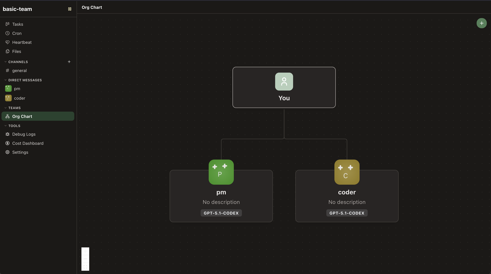

# agent-office

Run a team of AI coding agents that talk to each other, share tasks and work on a schedule, managed from a web dashboard. Works with cloud models (Anthropic, OpenAI, …) or your own local model via llama.cpp / vLLM.



## Quick start (Docker)

Needs Docker (on Windows: Docker Desktop with WSL integration turned on, and run these in WSL).

```bash
git clone https://github.com/nivekoddworld/agent-office.git
cd agent-office

cp -r examples/local-team offices/my-office   # start from an example office
nano offices/my-office/office.yaml            # set your model (see below)
echo "OFFICE=my-office" > .env                # which office to run

docker compose up -d
docker compose logs agent-office | grep Dashboard
```

Open the `http://127.0.0.1:3847/#token=…` link it prints. That's it.

Everything about your office — its `office.yaml`, the agents' files, logs — lives in `offices/my-office/`. After editing `office.yaml`, run `docker compose restart`.

## Choosing a model

Set `default_model` in `office.yaml` (agents can also override it with their own `model:`).

**Local model (llama.cpp / vLLM)** — use `llamacpp:<model-id>` or `vllm:<model-id>`. The model id is what your server lists at `/v1/models`:

```yaml
office:
  name: My Office
  default_model: llamacpp:qwen3-coder-30b
```

- **Server running on your machine:** start it with `--host 0.0.0.0` (llama.cpp needs `--jinja` too, vLLM needs `--enable-auto-tool-choice --tool-call-parser <parser>`). agent-office finds it on the default port (llama.cpp `8080`, vLLM `8000`).
- **Server running in another Docker container:** copy `docker-compose.override.example.yml` to `docker-compose.override.yml`, put your network's name in it (`docker network ls`), and point the office at the container by name:
  ```yaml
  office:
    providers:
      llamacpp:
        base_url: http://llama:8080 # container name + port inside it
  ```
  Check it can connect: `docker compose exec agent-office curl -s http://llama:8080/v1/models`

**Cloud model** — e.g. `anthropic:claude-sonnet-4-5` or `openai:gpt-5.4`, with the API key in `.env` (`ANTHROPIC_API_KEY=…`, `OPENAI_API_KEY=…`; see `.env.example`).

## One container per agent (optional)

By default all agents run inside the one `agent-office` container: isolated from your machine, but not from each other. To give **each agent its own container** (it only sees its own workspace, and gets only its own model key, not the rest of `.env`):

1. In `.env`: `SANDBOX=docker`
2. In `docker-compose.override.yml` (copy it from `docker-compose.override.example.yml`), uncomment the two `volumes:` lines that mount `/var/run/docker.sock`
3. `docker compose up -d` — the first start builds the agent image, which takes a few minutes

Agent containers show up as `pi-agent-<name>` in `docker ps`, join the same networks as agent-office (so they reach your llama.cpp container too), and are removed on `docker compose down`.

> **Trade-off:** mounting the Docker socket lets agent-office control Docker on your machine, which is effectively root access. The agents themselves never get the socket.

## Everyday commands

| What                        | Command                                              |
| --------------------------- | ---------------------------------------------------- |
| Start / stop                | `docker compose up -d` / `docker compose down`       |
| Apply `office.yaml` changes | `docker compose restart`                             |
| Watch the logs              | `docker compose logs -f agent-office`                |
| Dashboard link again        | `docker compose logs agent-office \| grep Dashboard` |
| Update to the latest code   | `git pull && docker compose up -d --build`           |

## Configuring agents

An office is one `office.yaml`: shared settings plus a list of agents.

```yaml
office:
  name: My Office
  default_model: llamacpp:qwen3-coder-30b

agents:
  lead:
    description: "Team lead — plans work and reviews results"
    prompt_inline: |
      Break work into tasks for the coder and review what comes back.
  coder:
    description: "Writes and debugs code"
    reports_to: lead
```

More ready-made offices are in [`examples/`](examples/). Every option (cron jobs, permissions, tools, channels, OAuth logins, …) is in the **[full reference](docs/REFERENCE.md)**.

## Without Docker

Needs Node.js 22.19+ and pnpm.

```bash
pnpm install
mkdir -p ~/.agent-office/offices && cp -r examples/local-team ~/.agent-office/offices/my-office
pnpm dev start --office my-office
```

## More

- [Full reference](docs/REFERENCE.md) — architecture, all `office.yaml` fields, CLI, REST API, agent tools
- [Examples](examples/) — ready-to-copy offices
