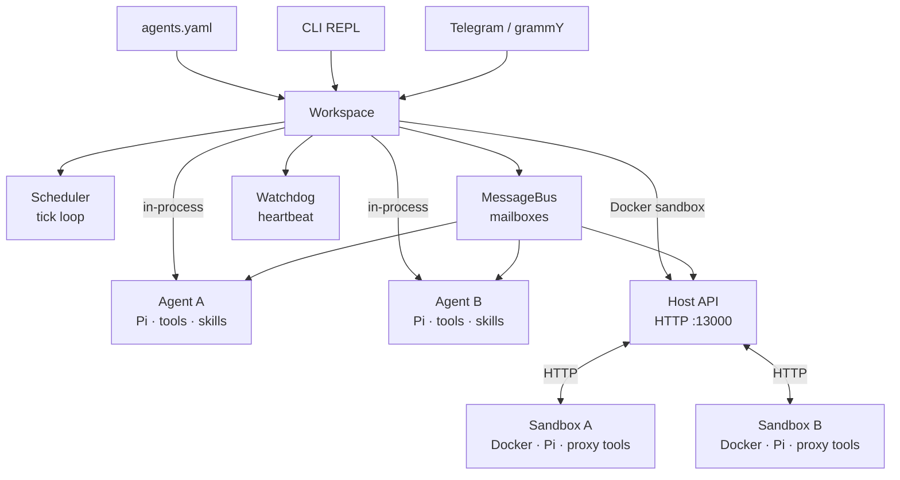

# pi-tests

FreeRTOS-inspired multi-agent workspace manager built on [Pi](https://github.com/nichochar/pi-mono). Spawns and orchestrates AI agent instances with tick-based scheduling, priority queues, mailbox IPC, cross-agent file access, watchdog monitoring, optional Docker sandbox isolation, declarative YAML configuration, and Telegram as a messaging frontend.

## Architecture



**Core flow:** `agents.yaml` (auto-spawn) / CLI / Telegram -> Workspace -> Scheduler tick -> drain mailbox -> dispatch to Pi Agent -> agent runs tools -> response streamed to Telegram.

Each agent is a full Pi coding agent with its own filesystem workspace, skills, and injected collaboration tools (`send_mail`, `list_agents`, `read_agent_file`). The scheduler runs a FreeRTOS-style tick loop that serves agents by priority, one message per tick per agent, non-blocking.

Agents can run **in-process** (default) or inside **Docker containers** for full process-level isolation.

## Quick Start

```bash
pnpm install

# Configure .env
cp .env.example .env   # then fill in your keys

# Start the REPL (in-process agents, Telegram auto-connects if token set)
pnpm dev start

# Start with Docker sandbox isolation
pnpm dev start --sandbox docker
```

Create a `.env` file with your provider keys:

```env
OPENAI_API_KEY=sk-...
# ANTHROPIC_API_KEY=sk-...
# GEMINI_API_KEY=...
TELEGRAM_BOT_TOKEN=...          # Telegram bridge auto-enables when set
# TELEGRAM_ENABLED=false        # Set to disable Telegram
# ALLOWED_USERS=alice,bob       # Comma-separated allowlist (empty = open access)
```

## Declarative Configuration (`agents.yaml`)

Define your workspace once in `~/.pi-tests/agents.yaml` and agents auto-spawn on startup. No more manual REPL commands on every restart.

```yaml
# ~/.pi-tests/agents.yaml
agents:
  designer:
    model: anthropic:claude-sonnet-4-20250514
    priority: normal        # idle | low | normal | high | critical (or 0-4)
    thinking: low           # off | minimal | low | medium | high | xhigh
    description: "Frontend designer — builds HTML/CSS"
    prompt: |
      You are a frontend designer specializing in responsive layouts.
      Focus on clean, semantic HTML and modern CSS.
    skills:
      - nichochar/web-skills

  reviewer:
    model: openai:gpt-4.1
    priority: high
    thinking: medium
    description: "Code reviewer"
```

All fields are optional. Agents are spawned sequentially in declaration order; if one fails, the rest still start.

| Field | Type | Default | Description |
|---|---|---|---|
| `model` | string | `anthropic:claude-sonnet-4-20250514` | `provider:model-id` |
| `priority` | string \| number | `normal` | Priority name or 0-4 |
| `thinking` | string | `low` | `off` / `minimal` / `low` / `medium` / `high` / `xhigh` |
| `description` | string | `""` | Visible to other agents |
| `prompt` | string | _(built-in default)_ | Custom system prompt |
| `cwd` | string | `~/.pi-tests/agents/<name>/workspace` | Working directory |
| `skills` | string[] | `[]` | GitHub sources to auto-install (`owner/repo`) |

### Auto-Sync

REPL commands automatically keep `agents.yaml` in sync:

- **`spawn`** persists the agent to YAML (use `--ephemeral` to skip)
- **`kill`** removes the agent from YAML
- **`skill add/remove`** updates the agent's `skills` array in YAML

All writes are atomic (temp file + rename) and serialized through an in-process config lock to prevent concurrent corruption.

### Reload

```bash
# In the REPL:
pi> agents reload              # Spawn new agents from YAML, skip already-running
pi> agents reload --force      # Kill and re-spawn agents with changed config
pi> agents validate            # Dry-run: parse + validate without spawning
pi> agents path                # Print path to agents.yaml
```

Change detection uses normalized config comparison (resolved model, numeric priority, sorted skills, trimmed prompt) so cosmetic YAML differences like `normal` vs `2` or reordered skills don't trigger false warnings.

## Sandbox Modes

pi-tests supports two execution modes for agents:

### In-Process Mode (default)

```bash
pnpm dev start                  # or explicitly:
pnpm dev start --sandbox none
```

Agents run in the same Node.js process as the scheduler. Simple, fast, zero setup. Tools call directly into the message bus and filesystem.

**Best for:** development, single-user setups, trusted agent code.

### Docker Sandbox Mode

```bash
pnpm dev start --sandbox docker
```

Each agent runs inside an isolated Docker container with hardened security. Agents communicate with the host via HTTP through the Host API.

**Best for:** untrusted agent code, multi-tenant environments, production deployments.

**Requirements:** Docker must be installed and running.

#### How Docker Sandbox Works

```
Host Process                        Docker Container (per agent)
+---------------------------+       +-----------------------------+
| Workspace                 |       | sandbox-entry.ts            |
| Scheduler + MessageBus    |       | Pi Agent + coding tools     |
| Host API server (:13000)  |<-HTTP>| Proxy tools (HTTP->Host)    |
| DockerProvider            |       | HTTP server (:3100)         |
| Watchdog                  |       | Heartbeat loop (5s)         |
+---------------------------+       +-----------------------------+
```

1. **Workspace** generates a unique auth token per agent and registers it with the Host API.
2. **DockerProvider** builds the `pi-sandbox` Docker image (once), then runs a container per agent with:
   - `--cap-drop=ALL` — no Linux capabilities
   - `--security-opt no-new-privileges` — no privilege escalation
   - `--user 1000:1000` — non-root user
   - Volume mount: host workspace directory -> `/workspace` in container
3. **sandbox-entry.ts** (inside container) creates a Pi Agent with:
   - Local coding tools (read, write, edit, bash, grep, find, ls) scoped to `/workspace`
   - Proxy tools that forward `send_mail`, `list_agents`, `read_agent_file` to the Host API over HTTP
4. **Host API** authenticates requests via Bearer token, executes them against the message bus / filesystem, and returns results.
5. **Prompt flow:** Host sends `POST /prompt` to container -> agent processes -> container sends `POST /api/prompt-done` back to host.
6. **Heartbeat:** Container sends `POST /api/heartbeat` every 5 seconds. Watchdog monitors these for stuck detection.

#### Docker Sandbox Security Model

| Protection | Mechanism |
|---|---|
| Process isolation | Separate Docker container per agent |
| No root access | `--user 1000:1000`, `--cap-drop=ALL`, `no-new-privileges` |
| Filesystem isolation | Only the agent's own workspace is mounted |
| Cross-agent file access | Proxied through Host API with path traversal guards |
| Authentication | Unique per-agent Bearer token, server-side validation |
| Message integrity | Server derives sender identity from token, never trusts body |
| Idempotency | `messageId`-based deduplication with 5-minute TTL |
| Request limits | 64 KB send-mail body, 1 MB general body, 1 MB file response |
| Prompt timeout | 5-minute timeout on prompt completion |

#### Docker Sandbox Example

```bash
# Terminal 1: Start with Docker sandbox
pnpm dev start --sandbox docker

# In the REPL:
pi> spawn designer --model anthropic:claude-sonnet-4-20250514 --desc "Frontend designer"
# → [agent:designer] Started in sandbox (http://localhost:13100)

pi> spawn reviewer --model openai:gpt-4.1 --desc "Code reviewer"
# → [agent:reviewer] Started in sandbox (http://localhost:13101)

pi> send designer "Create a responsive landing page with hero section"
# → designer works inside its Docker container, edits files in /workspace
# → Files persist at ~/.pi-tests/agents/designer/workspace/ on the host

pi> send reviewer "Review designer's index.html and send feedback"
# → reviewer uses read_agent_file (proxied via Host API) to read designer's files
# → reviewer uses send_mail (proxied via Host API) to send feedback to designer
```

Verify files created by sandboxed agents persist on the host:

```bash
ls ~/.pi-tests/agents/designer/workspace/
# index.html  styles.css  ...
```

#### Host API Endpoints

The Host API runs on port 13000 (configurable) and provides the bridge between sandboxed agents and the host system.

| Method | Path | Purpose |
|---|---|---|
| `POST` | `/api/send-mail` | Forward message to another agent's mailbox |
| `GET` | `/api/agents` | List all agents (name, status, description) |
| `GET` | `/api/agent-file?agent=X&path=Y` | Read file from another agent's workspace |
| `POST` | `/api/prompt-done` | Notify host that a prompt completed |
| `POST` | `/api/heartbeat` | Update agent heartbeat timestamp |

All endpoints require `Authorization: Bearer <token>` header. The token is generated per agent by the host and injected into the container as an environment variable.

## REPL Commands

| Command | Description |
|---|---|
| `spawn <name> [options]` | Create a new agent (persists to YAML unless `--ephemeral`) |
| `list` | Show all agents with status table |
| `send <agent> <message>` | Queue a message for an agent |
| `kill <agent>` | Stop and remove an agent (removes from YAML) |
| `status` | Show scheduler, watchdog, and resource state |
| `skill add <agent> <source>` | Install skills from GitHub (`owner/repo`) |
| `skill list <agent>` | List installed skills |
| `skill remove <agent> <name>` | Remove an installed skill |
| `agents reload [--force]` | Re-apply `agents.yaml` (force kills changed agents) |
| `agents validate` | Dry-run: parse + validate YAML without spawning |
| `agents path` | Print path to `agents.yaml` |
| `route <chatId> <agent>` | Route a Telegram chat to an agent |
| `route list` | List all Telegram chat routes |
| `help` | Show available commands |
| `exit` | Shutdown |

### Spawn Options

```
spawn <name>
  --model <provider:id>     Model (default: anthropic:claude-sonnet-4-20250514)
  --priority <0-4>          0=IDLE, 1=LOW, 2=NORMAL, 3=HIGH, 4=CRITICAL
  --thinking <level>        off, minimal, low, medium, high, xhigh
  --cwd <path>              Custom workspace dir (default: ~/.pi-tests/agents/<name>/workspace)
  --desc <text>             Agent description (visible to other agents)
  --prompt <text>           Custom system prompt
  --ephemeral               Don't persist to agents.yaml
```

### CLI Flags

```
pnpm dev start
  --tick-interval <ms>      Scheduler tick interval (default: 2000)
  --sandbox <mode>          Sandbox mode: none | docker (default: none)
```

Telegram is enabled automatically when `TELEGRAM_BOT_TOKEN` is set. Disable via `TELEGRAM_ENABLED=false` in `.env`.

## Agent Collaboration

Agents discover and communicate with each other autonomously through three built-in tools. Tool schemas are defined once in `src/agent/tools/contracts.ts` and shared by both in-process and proxy (sandbox) implementations.

### `list_agents`

Discover all agents in the workspace with their name, status, and description. Agents are instructed to call this first when given a task to find collaborators.

### `send_mail`

Send a message to another agent's mailbox. Messages are delivered on the next scheduler tick as a new prompt prefixed with `[Mail from sender]`. Use `__broadcast__` to message all agents.

```
copywriter calls send_mail:
  to: "designer"
  message: "Here's the landing page copy: ..."

-> Message lands in designer's mailbox
-> Next tick delivers it as: [Mail from copywriter]\nHere's the landing page copy: ...
-> Designer starts working
```

### `read_agent_file`

Read files directly from another agent's workspace without needing to ask them. Path traversal is blocked for security.

```
reviewer calls read_agent_file:
  agent: "designer"
  path: "index.html"

-> Returns contents of ~/.pi-tests/agents/designer/workspace/index.html
```

In Docker sandbox mode, this tool is proxied through the Host API. The agent sends an HTTP request to the host, which reads the file on disk and returns the content. The sandboxed agent never has direct filesystem access to other agents' workspaces.

### Tool Architecture

```
src/agent/tools/
  contracts.ts              Single source of truth (name, label, description, parameters)
  send-mail.ts              Host implementation (direct bus.send)
  list-agents.ts            Host implementation (direct listFn call)
  read-agent-file.ts        Host implementation (direct fs access)
  proxy/
    send-mail.ts            Sandbox implementation (HTTP POST /api/send-mail)
    list-agents.ts          Sandbox implementation (HTTP GET /api/agents)
    read-agent-file.ts      Sandbox implementation (HTTP GET /api/agent-file)
    index.ts                Barrel export + HostFetch type
```

In-process agents use the host implementations directly. Sandboxed agents use the proxy implementations, which forward requests to the Host API over HTTP. Both share the same tool contracts to prevent schema drift.

### Collaboration Prompt

Agents are prompted to:

- Always use `list_agents` first to discover collaborators
- Use `send_mail` for delegation and `read_agent_file` for code review
- Never ask the user for information another agent can provide
- Avoid reply loops — only send actionable messages, not pleasantries
- Report completion back to the user when all delegated work is done

## Telegram Integration

Telegram bridge auto-enables when `TELEGRAM_BOT_TOKEN` is set in `.env` or the environment. All agent events (tool calls, text responses, completion) stream to the originating chat.

```env
# .env
TELEGRAM_BOT_TOKEN=xxx
# TELEGRAM_ENABLED=false   # uncomment to disable
# ALLOWED_USERS=alice,bob  # optional allowlist
```

```bash
pnpm dev start   # Telegram connects automatically
```

### Telegram Commands

| Command | Description |
|---|---|
| `/agents` | List all running agents |
| `/help` | Show available commands |
| `@agentname message` | Send directly to a specific agent |
| _(plain text)_ | Send to the default agent or routed agent |

Each agent's events route to the chat that triggered it, so multiple chats can interact with different agents concurrently.

## Concepts

### Tick-Based Scheduler

The scheduler runs a `setInterval` tick loop (default 2s). Each tick:

1. Sorts agents by priority (CRITICAL=4 first, IDLE=0 last)
2. Skips agents currently running (`status === "running"`)
3. Drains each agent's mailbox, delivers the highest-priority message
4. Dispatches non-blocking — all agents run concurrently via async I/O
5. Re-queues remaining messages for the next tick

```
--tick-interval <ms>    Configure via CLI flag (default: 2000)
```

### Priority Levels

| Level | Value | Use case |
|---|---|---|
| `IDLE` | 0 | Background tasks, monitoring |
| `LOW` | 1 | Review, optimization |
| `NORMAL` | 2 | Standard work (default) |
| `HIGH` | 3 | Primary agents, user-facing |
| `CRITICAL` | 4 | Urgent, time-sensitive |

Higher-priority agents are always served first. One message per tick per agent prevents starvation.

### Workspace Sandboxing

Each agent gets an isolated workspace on the host filesystem:

```
~/.pi-tests/
  agents.yaml               # declarative agent definitions
  agents/
    designer/
      workspace/            # agent's cwd — all file tools scoped here
      skills/               # installed skill directories
        .sources.json       # skill folder → GitHub source mapping
    reviewer/
      workspace/
      skills/
```

All file tools (read, write, edit, bash) are scoped to the agent's workspace directory. Agents can read each other's files via `read_agent_file` but cannot write to them.

In Docker sandbox mode, the workspace directory is volume-mounted into the container at `/workspace`. File changes made inside the container persist on the host.

### Skills

Markdown files loaded from each agent's `skills/` directory and injected into the system prompt. Skills work in both in-process and Docker sandbox modes.

Skills can be installed via REPL or declared in `agents.yaml`:

```yaml
# agents.yaml — skills auto-install on startup
agents:
  designer:
    skills:
      - nichochar/web-skills
```

```bash
# REPL — installs to disk + updates agents.yaml
pi> skill add designer nichochar/web-skills
pi> skill list designer
pi> skill remove designer web-tools
```

A `.sources.json` file in each agent's skills directory maps installed skill folders back to their GitHub source, so `skill remove` can clean up `agents.yaml` entries when the last skill from a source is removed.

### Watchdog

Periodic heartbeat checks (default: every 10s). If an agent's last heartbeat exceeds the stuck threshold (default: 120s), it aborts and re-initializes with a fresh Pi instance. Every agent event resets the heartbeat timer.

For Docker-sandboxed agents, heartbeats are received via `POST /api/heartbeat` from the container (every 5s) and fed into the watchdog through the same monitoring path.

### Resource Guards

Mutex and semaphore primitives for coordinating shared resource access:

```ts
// Mutex — one holder at a time
const release = await workspace.mutex.acquire("database", "agent-a");
release();

// Semaphore — N concurrent holders
workspace.semaphore.create("api-rate-limit", 3);
const release = await workspace.semaphore.acquire("api-rate-limit");
release();
```

## End-to-End Examples

### Example 1: In-Process Multi-Agent Collaboration

Three agents collaborate on a landing page, all running in-process:

```
pi> spawn designer --model openai:gpt-5.2-codex --desc "Frontend designer — builds HTML/CSS"
pi> spawn copywriter --model openai:gpt-5.2-codex --desc "Copywriter — writes marketing copy"
pi> spawn reviewer --model openai:gpt-5.2-codex --desc "Code reviewer — reviews quality"
```

Via Telegram:

```
@copywriter Write landing page copy for FlowPilot, an AI task manager.
Include hero, 3 features, CTA. Send to designer when done.
```

What happens:

1. **copywriter** writes copy, uses `list_agents` to discover designer, sends via `send_mail`
2. **designer** receives mail, builds `index.html` with the copy
3. You send: `@reviewer Review designer's work and send feedback`
4. **reviewer** calls `list_agents`, uses `read_agent_file` to read designer's HTML, sends feedback via `send_mail`
5. **designer** applies fixes, **copywriter** reports completion to the user

All coordination is autonomous after the initial prompt.

### Example 2: Docker-Sandboxed Agent Workflow

Isolated agents working on a Node.js API project:

```bash
# Start with Docker isolation
pnpm dev start --sandbox docker
```

```
pi> spawn backend --model anthropic:claude-sonnet-4-20250514 --desc "Backend developer — writes Node.js APIs"
# → Container started with --cap-drop=ALL, --user 1000:1000

pi> spawn tester --model anthropic:claude-sonnet-4-20250514 --desc "QA engineer — writes and runs tests"

pi> send backend "Build a REST API for a todo app with CRUD endpoints using Express"
```

What happens behind the scenes:

1. **DockerProvider** builds the `pi-sandbox` image (once, cached)
2. Two containers start on ports 13100 and 13101
3. **backend** agent runs inside its container:
   - Uses `bash`, `write_file`, `edit_file` tools locally in `/workspace`
   - Creates `server.js`, `package.json`, route files
   - Files appear at `~/.pi-tests/agents/backend/workspace/` on host
4. You send: `@tester Review backend's code and write tests`
5. **tester** calls `list_agents` (proxy -> Host API -> returns agent list)
6. **tester** calls `read_agent_file` (proxy -> Host API -> reads backend's files from host disk)
7. **tester** writes test files in its own `/workspace`
8. **tester** sends feedback to **backend** via `send_mail` (proxy -> Host API -> message bus)

Each agent is fully isolated — a misbehaving agent cannot crash the host, read secrets, or access another agent's filesystem directly.

### Example 3: Mixed Mode with Telegram

```bash
TELEGRAM_BOT_TOKEN=xxx pnpm dev start --sandbox docker
```

```
# In Telegram:
@backend Set up a PostgreSQL schema for users and posts
@frontend Build a React dashboard that displays user stats

# Both agents work in isolated containers
# Files persist on host for inspection
# Status visible via /agents command in Telegram
```

## Project Structure

```
src/
  index.ts                    CLI entry + REPL
  workspace.ts                Central facade (wires scheduler, bus, watchdog, sandbox)
  types.ts                    Shared types (Priority, AgentConfig, SandboxMode, etc.)
  constants.ts                Shared constants (PI_TESTS_DIR)
  routing.ts                  Telegram chat -> agent routing

  config/
    agents-yaml.ts            YAML loader, validator, write-back helpers
    lock.ts                   In-process mutex for config read-modify-write

  skills/
    fetch.ts                  Skill fetching, source map, reverse lookup

  agent/
    handle.ts                 Agent lifecycle (init, prompt, steer, abort, destroy)
    prompt.ts                 Default system prompt builder
    entrypoints/
      sandbox-entry.ts        Standalone process for Docker containers
    tools/
      contracts.ts            Shared tool metadata (name, label, description, parameters)
      index.ts                Barrel re-export for host-side tools
      send-mail.ts            send_mail — host implementation (bus.send)
      list-agents.ts          list_agents — host implementation (direct call)
      read-agent-file.ts      read_agent_file — host implementation (local fs)
      proxy/
        index.ts              Barrel + HostFetch type
        send-mail.ts          send_mail — proxy implementation (HTTP)
        list-agents.ts        list_agents — proxy implementation (HTTP)
        read-agent-file.ts    read_agent_file — proxy implementation (HTTP)

  sandbox/
    types.ts                  SandboxProvider interface, SandboxMode, SandboxStartOpts
    host-api.ts               HTTP server for sandbox-to-host communication
    docker-provider.ts        Docker container lifecycle (build, run, stop, health)
    Dockerfile                Container image definition (node:22-slim, non-root)
    package.json              Sandbox-specific npm dependencies
    index.ts                  Barrel export

  scheduler/
    scheduler.ts              Tick-based priority scheduler
    watchdog.ts               Heartbeat monitor + stuck detection

  transport/
    local.ts                  In-process priority mailbox queues
    message-bus.ts            Bus wrapper over transport

  bridges/
    telegram.ts               grammY Telegram bridge

  commands/
    agents-yaml.ts            Apply logic + agents reload/validate/path commands
    spawn.ts                  Agent creation with YAML auto-sync
    list.ts                   Agent status table
    send.ts                   Message queueing
    kill.ts                   Agent teardown with YAML auto-sync
    status.ts                 Scheduler/watchdog overview
    route.ts                  Telegram chat routing
    skill.ts                  Skill install/remove with YAML + source map sync

test/
  agents-yaml.test.ts        YAML config: parsing, validation, apply, write-back, locking
  docker-provider.test.ts     Docker provider (mocked execFile + fetch)
  host-api.test.ts            Host API endpoints, auth, prompt correlation
  tool-contracts.test.ts      Verifies host + proxy tools share contracts
  sandbox-validation.test.ts  CLI --sandbox option validation
  tools.test.ts               Host-side tool behavior
  scheduler.test.ts           Tick loop, priority ordering
  watchdog.test.ts            Heartbeat, stuck detection, restart
  message-bus.test.ts         Mailbox routing, rate limiting
  local-transport.test.ts     Priority queue ordering
  handle-skills.test.ts       Skill paths for in-process + sandbox agents
  prompt.test.ts              System prompt generation
```

## Dependencies

| Package | Purpose |
|---|---|
| `@mariozechner/pi-agent-core` | Pi agent runtime |
| `@mariozechner/pi-coding-agent` | Coding tools (read, write, edit, bash, grep, find, ls) + skills |
| `@mariozechner/pi-ai` | Model registry + streaming |
| `@sinclair/typebox` | Tool parameter schemas |
| `commander` | CLI argument parsing |
| `dotenv` | Load `.env` into `process.env` |
| `grammy` | Telegram Bot API |
| `yaml` | YAML parsing with comment-preserving Document API |

## Development

```bash
pnpm install          # Install dependencies
pnpm build            # TypeScript type check (tsc --noEmit)
pnpm check            # ESLint
pnpm test             # Run test suite (vitest) — 162 tests
pnpm test:watch       # Run tests in watch mode
pnpm dev start        # Run in dev mode (tsx)
```

Tests live in `test/` (one file per module, `<feature>.test.ts` naming).

Requires Node 22+ and Docker (for sandbox mode).
